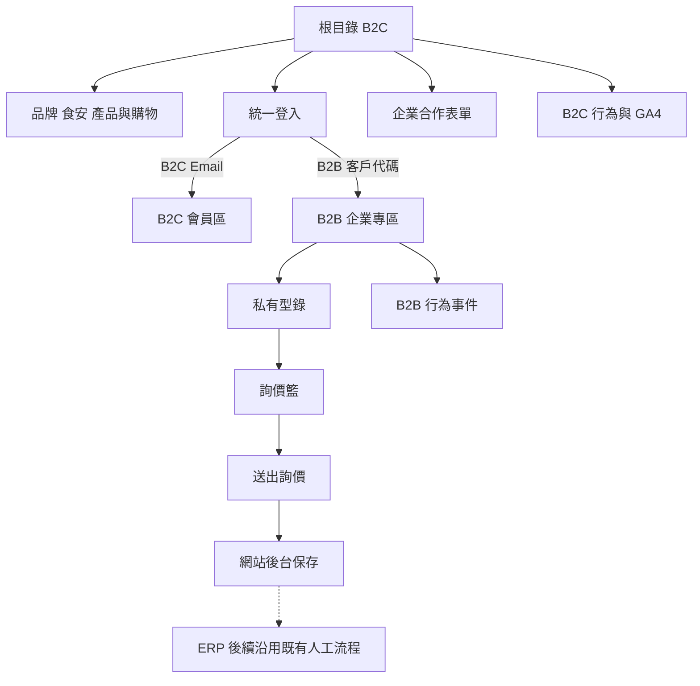
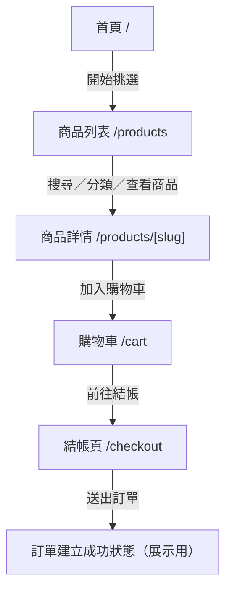
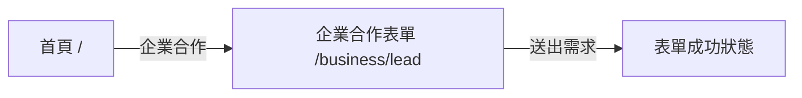
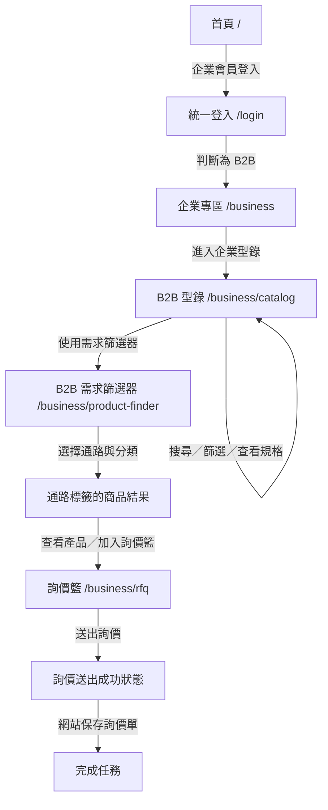

# 元家企業／宅鮮配整合網站 MVP v3.1

## Product Requirements Document

文件版本：第三版（MVP v3.1）  
文件日期：2026-09-03  
Feature Complete：2026-09-10  
適用對象：產品負責人、三人開發團隊、展示與驗收人員

---

## 1. 產品摘要

本專案將元家企業的企業內容與產品資訊，和宅鮮配的 B2C 購物體驗，整合成單一品牌網站。根目錄固定以 B2C 為公開入口；既有企業客戶使用客戶代碼與公司共用密碼登入後，進入私有 B2B 型錄與詢價流程。

網站的 B2B 資料只保存網站必要的公司、型錄、詢價與行為資料。MVP 不與公司 ERP 串接，不保存 ERP 客戶名單、進貨明細、成本、底價或成交資料。詢價單留在網站後台，ERP 後續交接沿用公司既有流程。

### 1.1 MVP 原則

- / 是 B2C 公開首頁與主要品牌入口。
- /business 是既有企業客戶的私有專區。
- B2B 權限與資料歸屬以公司為單位，不追蹤個別採購、門市或分店登入者。
- B2B 型錄不顯示價格；詢價單由公司提出，後續由既有業務與企業窗口聯絡。
- B2C 著重購物體驗、食品安全、認證、品質與產地內容。
- 透過網站行為與詢價資料，提供內部管理者基本分析。
- 2026-09-10 前完成 MVP 並凍結；之後只修正 Bug、視覺、響應式、效能、無障礙與文件。

## 2. 背景、問題與機會

### 2.1 現況問題

1. 企業官網與宅鮮配購物網站分散，品牌流量、產品資訊與購物路徑沒有形成單一入口。
2. B2C 需要更清楚的分類、商品排版與食品安全信任內容。
3. 既有企業客戶需要查找 2000+ 品項，但缺少一致、可搜尋的私有型錄。
4. B2B 客戶提出產品需求後，仍需由既有業務窗口人工聯絡與報價。
5. 公司需要知道哪些產品被詢價、哪些級距與通路的企業客戶使用網站，但目前缺乏可統計資料。
6. ERP 包含商業敏感資料，網站開發商不應因網站功能而取得 ERP 全量資料。

### 2.2 機會

- 以單一 B2C 公開入口集中品牌、產品與 SEO 內容。
- 以公司級 B2B 登入降低既有企業客戶查找型錄與提出詢價的成本。
- 以客戶代碼前綴推導企業級距與通路，分析不同企業群組的網站使用狀態。
- 以伺服器端保存詢價與行為事件，避免把企業識別資料直接送入 GA4。

## 3. 產品目標與非目標

### 3.1 MVP 目標

- 建立 B2C 首頁、導覽、分類、搜尋、商品列表、商品詳情、產品標籤頁、購物車與結帳頁。
- 建立食品安全、認證、品質與產地相關的公開信任內容。
- 建立 B2B 公司級登入、私有型錄、搜尋篩選、詢價籃與詢價送出。
- 建立公司客戶代碼前綴規則，推導客戶級距與通路標籤。
- 建立 B2B 與 B2C 行為事件及基本管理者分析畫面。
- 保存 B2B 詢價單與 B2C 模擬訂單。
- 完成 SEO 基礎、結構化資料、GA4、響應式與基本 WCAG 2.2 AA。

### 3.2 明確不納入 MVP

- ERP API、ERP 資料庫、ERP 檔案交換或自動同步。
- ERP 客戶名單、採購明細、進貨成本、底價、成交金額與真實銷售額分析。
- 網站內的業務指派、業務接洽紀錄、報價版本、CRM 或業務績效管理。
- B2B 個人帳號、Email 登入、個別使用者密碼與個人登入追蹤。
- 公開團購專區、團購價格、團購 SEO 頁面或團購商品清單。
- 客訴與售後服務管理模組，包含正式版。
- 防截圖保證、DRM、右鍵封鎖或高強度內容保護。
- 完整 2000+ 商品資料清洗與正式內容遷移；MVP 使用代表性展示資料驗證資料結構。
- B2C 真實金流、物流、正式訂單、正式會員註冊與第三方商城 API。
- 真實 AI API；B2C AI 智能問答僅提供固定內容示範。
- 可由後台新增、編輯或刪除標籤定義；標籤定義由開發團隊預先建立，後台只套用既有標籤。
- Email、簡訊、推播與正式通知。
- 完整 BI、熱區、錄影、停留時間分析與複雜漏斗。

## 4. 使用者、角色與帳號原則

| 角色 | 主要需求 | MVP 權限 |
|---|---|---|
| B2C 訪客 | 瀏覽品牌與商品、購物、結帳 | 可進入 /、/products、/cart、/checkout |
| B2C 展示會員 | 驗證 B2C 登入分流 | 留在 B2C，不可進入 B2B |
| B2B 公司使用者 | 查詢私有型錄、整理公司需求、送出詢價 | 使用公司客戶代碼與共用密碼，資料歸屬公司 |
| B2B 新客 | 了解合作方式並聯絡業務 | 從 B2C 進入企業合作展示表單 |
| 內部管理者 | 維護公司帳號、型錄、規則、詢價、模擬訂單與分析 | 可進入 /admin |

### 4.1 B2B 帳號模型

- 每家公司建立一個 Supabase Auth identity。
- 公司內部多人共用同一組客戶代碼與公司密碼。
- 不保存個別登入者、採購、門市或分店的識別資訊。
- 同一公司的詢價單與行為事件皆以 company_id 歸屬。
- 內部管理者負責建立、啟用、停用與重設公司密碼。
- 共用帳密代表網站無法追蹤個人登入者；此為已確認的業務取捨。

## 5. 核心資訊架構與登入分流



### 5.1 路由權限規則

| 路由 | 未登入 | B2C 會員 | B2B 公司使用者 | 管理者 |
|---|---|---|---|---|
| / | B2C 首頁 | B2C 首頁 | 導回 /business | B2C 首頁 |
| /products | 允許 | 允許 | 不允許 B2C 購物流程 | 允許 |
| /products/tags/[slug] | 允許 | 允許 | 不允許 B2C 購物流程 | 允許 |
| /products/[slug] | 允許 | 允許 | 不允許 B2C 購物流程 | 允許 |
| /cart、/checkout | 允許 | 允許 | 拒絕並提示需登出 | 允許展示 |
| /business | 導向登入 | 返回 B2C | 導向型錄 | 不提供 B2B 權限 |
| /business/catalog | 導向登入 | 拒絕 | 允許 | 不提供 B2B 權限 |
| /business/product-finder | 導向登入 | 拒絕 | 允許 | 不提供 B2B 權限 |
| /business/rfq | 導向登入 | 拒絕 | 允許 | 可由後台查看 |
| /business/lead | 允許 | 允許 | 不從 B2B 導覽進入 | 允許 |
| /admin | 拒絕 | 拒絕 | 拒絕 | 允許 |

### 5.2 MVP Sitemap

```text
/
├── 首頁（B2C）
├── /about
│   └── 品牌故事／企業介紹／食品安全／品質／產地
├── /products
│   ├── /products/[slug]
│   │   └── 商品詳情
│   └── /products/tags/[slug]
│       └── B2C 標籤產品列表
├── /cart
│   └── 購物車
├── /checkout
│   └── 結帳頁（建立模擬訂單）
├── /business/lead
│   └── 企業合作展示表單
├── /login
│   └── 統一登入
├── /business
│   ├── /business/catalog
│   │   └── B2B 私有型錄
│   ├── /business/product-finder
│   │   └── B2B 需求篩選器
│   └── /business/rfq
│       └── B2B 詢價籃／送出詢價
└── /admin
    └── 內部管理後台
```

Sitemap 邊界：

- B2B 商品規格查看整合在 /business/catalog，不新增 B2B 商品詳情路由。
- 結帳成功與詢價送出成功為頁面狀態，不新增獨立頁面。
- B2C 需求釐清工具以全站浮動工具的對話框呈現，不新增可索引的工具路由。
- B2B 需求篩選器為登入後的私有頁面，不可被搜尋引擎索引。
- ERP 後續處理與業務聯絡不屬於網站頁面。
- 不建立團購專區、客訴頁面、CRM 頁面或個人 B2B 帳號頁面。

### 5.3 B2C 核心 User Flow



B2C 核心任務完成點：展示用模擬訂單成功建立。

### 5.3.1 B2C 需求釐清浮動工具流程

浮動工具顯示於所有 B2C 頁面右下角；不顯示於 B2B 與管理後台。

```mermaid
flowchart TD
    A[任一 B2C 頁面] --> B[右下角浮動工具]
    B --> C[展開對話框]
    C --> D[Line@固定外部連結]
    C --> E[篩選小工具]
    C --> F[AI智能問答固定示範]
    E --> G[Step 1料理方式]
    G --> H[Step 2需求特性]
    H --> I[Step 3產品類型]
    I --> J[Step 4其他偏好（可選）]
    J --> K[產品列表或單一產品詳情]
    K --> L[返回上一步／重新開始]
```

### 5.3.2 B2C 固定需求篩選流程

| 步驟 | 問題 | MVP 示範選項 | 對應條件 |
|---|---|---|---|
| 1 | 今天想怎麼吃？ | 火鍋、煎／烤、氣炸、清蒸、煮湯、生食 | B2C 料理方式標籤 |
| 2 | 你比較在意什麼？ | 方便料理、少刺／無刺、高蛋白、適合小孩、份量剛好 | B2C 需求／特性標籤 |
| 3 | 想吃哪一類？ | 魚類、蝦類、貝類、其他海鮮、都可以 | B2C 分類 |
| 4 | 還有其他偏好嗎？ | 原味、調味、即食／即煮、都可以 | B2C 加工／料理標籤 |

- 第 4 步可略過；固定流程不製作複雜跳題引擎。
- 多個答案轉為標籤或分類條件，採 AND「全部符合」邏輯。
- 多個產品符合時導向 B2C 標籤／分類產品列表。
- 只有單一產品符合時導向 B2C 商品詳情。
- 無符合商品時顯示「無符合商品」，並提供返回上一步與重新開始。
- AI 智能問答為固定內容示範，不接受任意問題、不串接 AI API、不保存對話。
- Line@ 只開啟固定外部連結，不建立客服系統。

### 5.4 B2C 公開企業合作支線



此表單在 MVP 只展示前端驗證與成功流程，不寫入資料庫。

### 5.5 B2B 核心 User Flow



B2B 核心任務完成點：詢價單成功保存於網站資料庫。後續由既有業務與企業窗口聯絡。

### 5.5.1 B2B 通路優先需求篩選流程

本節以 `docs/b2b-product-finder-channel-requirements.md` v1.0 為細節規格來源；若與舊版 B2B 四步題組描述不同，以本節及該規格書為準。B2C 固定四步篩選流程不受影響。

| 主要通路 | 第二層分類 | 查詢葉節點標籤 |
|---|---|---|
| 盤商／批發 | 小盤／中大型盤商 | `wholesale_small`／`wholesale_mid_large` |
| 電子商務 | 團購／直播／網購平台 | `ecommerce_group_buy`／`ecommerce_live`／`ecommerce_marketplace` |
| 量販／超市 | 無，直接顯示結果 | `mass_retail` |
| 傳統零售／專賣 | 傳統菜市場／海鮮專賣店 | `traditional_market`／`seafood_specialty_store` |
| 餐飲 | 一般餐飲／連鎖／宴會・外燴／飯店 | `foodservice_general`／`foodservice_chain`／`foodservice_banquet_catering`／`foodservice_hotel` |

- B2B 需求篩選器只有有效 B2B session 可使用。
- 流程固定為「主要通路 → 分類 → 商品結果」，不設第三層問題；量販／超市跳過第二層直接顯示結果。
- 每一層同時只能選擇一項；有分類的通路選到第二層後立即載入結果，沒有額外下一步。
- 支援返回通路／分類選擇與重新選擇；不再提供舊四步流程的「略過」選項或後台問卷編輯器。
- 結果只顯示具有完全相符葉節點通路標籤的商品；商品可有多個通路標籤，但不可依品類、魚種、既有用途、包裝或規格自動推論。
- 無符合商品時顯示明確說明，並提供重新選擇與前往企業型錄。
- 結果商品可查看詳情、選擇規格並加入詢價流程；不公開價格、即時庫存、MOQ 或供應承諾。

### 5.6 MVP 頁面 UX 規格

#### 共用與登入

| 頁面 | 使用者目的 | 主要 CTA | 下一步 |
|---|---|---|---|
| /login 統一登入 | 使用 Email 或客戶代碼登入 | 登入 | B2C 留在 B2C；B2B 前往 /business/catalog |

#### B2C 頁面

| 頁面 | 使用者目的 | 主要 CTA | 下一步 |
|---|---|---|---|
| / 首頁 | 了解品牌並開始探索商品 | 開始挑選 | /products |
| /about 品牌與信任內容 | 了解企業、食品安全、品質與產地 | 查看商品 | /products |
| /products 商品列表 | 搜尋、分類、標籤與篩選商品 | 查看商品 | /products/[slug] |
| /products/tags/[slug] 標籤產品列表 | 查看擁有指定標籤的所有 B2C 商品 | 查看商品 | /products/[slug] |
| /products/[slug] 商品詳情 | 查看規格、價格、產地、保存方式與產品標籤 | 加入購物車 | /cart |
| /cart 購物車 | 確認商品、數量與總額 | 前往結帳 | /checkout |
| /checkout 結帳 | 填寫配送資料並建立展示用模擬訂單 | 送出訂單 | 訂單建立成功狀態 |
| /business/lead 企業合作表單 | 讓 B2C 新客留下合作需求 | 送出需求 | 表單成功狀態 |
| B2C 浮動工具 | 釐清需求、開啟 Line@ 或查看固定 AI 示範 | 選擇功能 | 篩選結果、Line@ 外部頁面或固定回答 |

#### B2B 頁面

| 頁面 | 使用者目的 | 主要 CTA | 下一步 |
|---|---|---|---|
| /business 企業專區入口 | 進入既有企業客戶功能 | 進入企業型錄 | /business/catalog |
| /business/catalog 私有型錄 | 搜尋、篩選並查看產品規格 | 加入詢價籃 | /business/rfq |
| /business/product-finder 需求篩選器 | 依主要銷售通路與分類找到適用商品 | 查看商品規格 | 通路標籤的商品結果，再進入型錄／詢價 |
| /business/rfq 詢價籃 | 確認產品、數量、單位與備註 | 送出詢價 | 詢價送出成功狀態 |
| 詢價成功狀態 | 確認詢價單已保存 | 返回企業型錄 | /business/catalog |

#### 內部管理

| 頁面 | 使用者目的 | 主要 CTA | 下一步 |
|---|---|---|---|
| /admin 管理後台 | 管理公司帳號、型錄、前綴規則、詢價、模擬訂單與分析 | 選擇管理模組 | 留在 /admin 的對應模組 |

## 6. 功能需求

### 6.1 B2C 首頁、內容與導覽

**B2C-01 首頁**

- 根目錄以 B2C 視覺與購物探索為首要入口。
- 首屏包含品牌識別、主要行動按鈕與商品探索入口。
- 入口包含探索商品、會員登入、企業合作與購物車。
- 使用微互動與狀態回饋，不做複雜視差、影片 Hero 或沉浸式動效。

**B2C-02 公開信任內容**

- 提供品牌故事、企業介紹、食品安全、品質與產地內容。
- 內容使用繁體中文，支援手機與桌機閱讀。
- 內容頁可從導覽與首頁進入。
- 不出現團購專區、團購價格或團購商品清單。

**B2C-03 商品資料**

- 商品頁至少包含名稱、品牌、分類、規格、價格、來源／產地、保存方式、描述。
- 新增食品安全、認證／品質資訊欄位；展示資料可使用文字或標籤。
- 每個 B2C 商品可套用多個由開發團隊預先建立的標籤。
- 標籤具有固定群組，例如食材、料理方式、需求特性與加工方式。
- 標籤由後台從既有清單套用或移除，不允許自由輸入或建立新標籤。
- 商品可顯示模擬庫存。
- 明確標示 MVP 為展示資料，實際價格與庫存以正式商城為準。

**B2C-04 購物與結帳**

- 商品列表支援名稱、品牌、分類、規格與標籤篩選。
- 點擊產品標籤進入 `/products/tags/[slug]`，顯示擁有該標籤的所有有效商品。
- 多個標籤條件採 AND「全部符合」邏輯；沒有符合商品時顯示「無符合商品」。
- 購物車支援加入、刪除、數量調整、總額與清空。
- 購物車保存於瀏覽器。
- 購物車內容下方提供「前往結帳」CTA，導向 `/checkout`。
- 結帳頁顯示清楚的頁面標題與 H1「結帳」，必填收件人、手機、Email、配送地址與隱私權同意。
- 不串金流、不產生真實訂單。
- 送出後僅保存展示用模擬訂單，狀態為已建立、處理中或已完成；技術 API 保留 `/api/b2c/mock-orders`。

**B2C-05 需求釐清浮動工具**

- 所有 B2C 頁面右下角顯示浮動工具圖示；B2B 與後台不顯示。
- 點擊後展開可關閉的對話框，提供 Line@、篩選小工具與 AI 智能問答三個入口。
- 篩選小工具使用固定四步流程，支援返回、略過可選步驟與重新開始。
- 篩選結果依 B2C 分類與標籤使用 AND「全部符合」條件。
- 多項結果導向產品列表；單一結果導向產品詳情；無結果顯示「無符合商品」。
- Line@ 使用固定外部連結。
- AI 智能問答使用固定示範問題與回答，不串接 AI API、不保存對話、不提供任意問題輸入。

### 6.2 統一登入與分流

**AUTH-01 登入**

- 登入表單提供 Email／客戶代碼與密碼。
- B2C 使用展示 Email 與密碼。
- B2B 使用公司客戶代碼與公司共用密碼。
- 伺服器端判斷帳號類型，不由前端決定權限。

**AUTH-02 B2B 公司帳號管理**

- 管理者可建立公司資料與一組公司登入 identity。
- 管理者可設定、重設、啟用或停用公司密碼。
- 不提供自助註冊、忘記密碼、個人帳號或個人密碼。

**AUTH-03 自動分流**

- B2C 登入後留在 B2C。
- B2B 登入後導向 /business/catalog。
- B2B session 開啟 / 時導回 /business。
- 未登入或 B2C 會員進入 B2B 路由時拒絕或導向登入。
- B2B session 不可使用 B2C 購物車與結帳。

### 6.3 B2B 私有型錄

**B2B-01 型錄內容**

- 只有有效 B2B 公司 session 可查看型錄。
- 所有有效企業公司共用同一套型錄。
- 型錄不顯示 B2B 價格。
- 欄位包含名稱、產品編號、品牌、分類、圖片、規格／包裝、來源、保存方式與描述。

**B2B-02 搜尋與篩選**

- 支援關鍵字、分類、品牌、產品編號與 B2B 標籤。
- 每個 B2B 商品可套用多個由開發團隊預先建立的標籤；標籤群組與 B2C 分開。
- 標籤由後台從既有清單套用或移除，不允許自由輸入或建立新標籤。
- 多個標籤條件採 AND「全部符合」；無符合時顯示「無符合商品」。
- 提供 loading、無結果、清除篩選與錯誤狀態。
- MVP 以代表性資料驗證可擴充至 2000+ 商品的資料結構與操作方式。

**B2B-03 需求篩選器**

- `/business/product-finder` 只有有效 B2B 公司 session 可使用。
- 使用固定兩層通路流程：主要通路、必要時的通路分類；量販／超市直接顯示結果。
- 固定通路與葉節點標籤字典、中文顯示名稱及完整驗收條件以 `docs/b2b-product-finder-channel-requirements.md` v1.0 為準。
- 每個商品可套用 0 至多個既有通路標籤；標籤定義由開發團隊建立，管理者只可在商品上套用或移除，且不得自由輸入。
- 結果只比對完全相符的葉節點通路標籤；未標記商品不納入推薦結果，不得以前端或 API 推論補齊。
- 支援返回、重新選擇、loading、無結果與錯誤狀態；不提供舊四步流程的略過、第三層問題或後台問卷編輯器。
- 結果商品可進入 B2B 型錄查看詳情、選擇規格並加入詢價單；不公開價格、即時庫存、MOQ 或交期承諾。

### 6.4 B2B 詢價單

- 企業使用者可從商品卡或商品詳情加入詢價籃。
- 每個品項可填數量、單位與品項備註。
- 詢價單可填總備註。
- 空詢價單不可送出。
- 送出時伺服器由 session 取得 company_id，不可接受前端指定公司。
- 詢價單寫入網站資料庫，狀態為新建、處理中或已結案。
- 管理者可查看與更新狀態。
- 不做網站內業務指派、報價金額、接洽時間、CRM 或成交結果。
- ERP 交接不在 MVP 內，後續沿用公司既有人工流程。

### 6.5 客戶代碼前綴與分級

- 客戶級距與通路皆由客戶代碼前綴推導。
- 前綴規則由管理者後台維護。
- 每條規則包含前綴、級距標籤、通路標籤與啟用狀態。
- MVP 使用展示規則；沒有匹配規則時標記為未分類。
- 詢價與事件保存建立當下的級距／通路快照。
- 前端不得自行提交級距或通路。

### 6.6 行為資料與分析

**B2B 事件**

- 登入成功。
- 型錄瀏覽。
- 產品查看。
- 搜尋或篩選。
- 需求篩選器開始、回答、完成與結果點擊。
- 加入詢價籃。
- 送出詢價。

**B2C 事件**

- 商品查看。
- 搜尋或分類。
- 標籤點擊與標籤產品列表查看。
- 浮動工具開啟、需求篩選器開始、回答、完成與結果點擊。
- Line@ 點擊與固定 AI 示範開啟。
- 加入購物車。
- 開始結帳。
- 模擬訂單建立。

**分析畫面**

- 僅內部管理者可查看。
- 可依日期、客戶級距、通路、產品、分類與品牌篩選。
- 顯示登入與活躍公司數、產品查看次數、產品加入詢價次數、產品送出詢價次數、熱門產品與 B2C 行為統計。
- 不提供真實銷售額、ERP 資料、熱區、錄影或複雜 BI。
- 行為分析資料不包含姓名、電話、Email 或完整客戶代碼。

### 6.7 B2B 新客企業合作

- 從 B2C 導覽進入企業合作表單。
- 欄位包含公司名稱、聯絡人、Email、電話、產業／合作類型、產品需求與個資同意。
- MVP 只展示前端驗證與成功畫面，不寫入資料庫。
- 不使用團購作為公開專區或主要 SEO 詞。

### 6.8 內部管理後台

- 公司帳號：建立、啟用、停用、重設共用密碼。
- 產品型錄：查看與管理代表性資料。
- 產品標籤套用：從既有 B2B／B2C 標籤清單套用或移除標籤；不管理標籤定義。
- 前綴規則：維護客戶代碼前綴、級距與通路。
- 詢價單：查看、篩選與更新狀態。
- B2C 模擬訂單：查看與更新狀態。
- 分析：查看 B2B 與 B2C 基本統計。
- 不提供業務 CRM、客訴管理、ERP 操作與個人業務帳號。

## 7. SEO、GEO 與分析規範

### 7.1 SEO

- 可索引頁面：/、/products、B2C 商品詳情、B2C 分類頁、B2C 標籤產品列表、/about、/business/lead。
- B2C 需求釐清浮動工具、/checkout、B2B 型錄、B2B 需求篩選器、詢價與管理後台禁止索引。
- 公開頁面設定 title、description、canonical、sitemap 與 robots。
- 商品頁提供 Product 結構化資料。
- 根目錄提供 Organization 結構化資料。
- 商品分類與 B2C 標籤頁提供 Breadcrumb 結構化資料。
- 只有有內容且至少有一項有效商品的 B2C 標籤頁才放入 sitemap。
- `/checkout` 的頁面標題與 H1 使用「結帳」，但設定 `noindex`；搜尋引擎主要爬取商品、分類與標籤內容。
- MVP 不執行舊網域正式搬站、301 與 DNS 切換。

### 7.2 GEO

- 使用清楚的商品名稱、規格、來源、保存方式、食安與品質文字。
- 使用可讀的標題、段落與結構化資料。
- 不以 AI 搜尋排名或引用作為 MVP 通過條件。

### 7.3 GA4

- B2C 公開頁面安裝 GA4 基礎追蹤。
- B2C 自訂事件可送一般商品行為，但不可包含個資。
- B2B 公司級事件主要保存於網站資料庫，不把公司識別資訊送入 GA4。

## 8. 非功能需求

### 8.1 資安與資料最小化

- 所有寫入 API 由伺服器驗證身分、欄位與資源歸屬。
- Supabase RLS 必須啟用。
- 公司客戶代碼不公開給匿名使用者。
- 密碼只由 Supabase Auth 保存，應用資料不保存明文密碼。
- 不把 service role key 放入瀏覽器。
- 網站不保存 ERP 敏感資料。
- 不承諾防截圖；不使用右鍵封鎖破壞可用性或無障礙。

### 8.2 響應式與無障礙

- B2C、B2B 登入、型錄、詢價與管理後台可在手機與桌機完成。
- 表單具備 label、錯誤訊息、鍵盤操作與 focus 狀態。
- 不以顏色作為唯一狀態訊息。
- 支援 prefers-reduced-motion。
- 公開 B2C 頁面 Lighthouse 行動版目標 80 分以上。

## 9. 驗收標準

### 9.1 B2C

1. 訪客可瀏覽首頁、分類、搜尋、商品詳情與食安／品質內容。
2. 商品詳情可查看產地、保存、認證／品質資訊。
3. 訪客可加入購物車、調整數量、由購物車下方進入結帳並建立展示用模擬訂單。
4. B2C 行為事件可被保存或送至 GA4，且不含個資。
5. 商品詳情顯示多個產品標籤；點擊標籤可進入對應產品列表，無結果顯示「無符合商品」。
6. B2C 所有頁面右下角可開啟浮動工具，並可完成固定需求篩選、開啟 Line@ 或查看固定 AI 示範。
7. B2C 需求篩選支援返回與重新開始；多項結果到產品列表，單一結果到商品詳情。

### 9.2 B2B

1. 公司可使用客戶代碼與共用密碼登入。
2. 不同瀏覽器使用同一公司帳密時，詢價與行為皆歸屬同一公司。
3. B2B 可查看私有型錄、搜尋、篩選與產品規格。
4. B2B 可建立詢價籃並填寫數量、單位與備註。
5. 詢價單可保存於網站資料庫並在管理後台查看。
6. B2B 價格不會在型錄或 API 回傳。
7. 管理者可維護客戶代碼前綴規則。
8. B2B 產品可套用多個既有通路標籤；需求篩選器可在登入後完成「主要通路 → 分類 → 商品結果」流程，且只回傳完全相符葉節點標籤的商品。
9. B2B 標籤與需求篩選結果不會公開給未登入使用者或搜尋引擎。

### 9.3 分析與權限

1. 管理者可依日期、級距、通路、產品與分類查看分析。
2. 可查看產品被查看、加入詢價與送出詢價的次數。
3. B2B 使用者不能查看分析資料或其他公司的詢價。
4. 前端不能偽造 company_id、級距或通路。
5. 系統不呼叫 ERP，不保存 ERP 敏感資料。

### 9.4 邊界與錯誤狀態

- 錯誤登入、停用公司、無權限路由、空購物車、空詢價籃、無搜尋結果與 API 錯誤皆有明確提示。
- 不存在團購專區、客訴模組、CRM、ERP 串接與防截圖功能。
- 結帳頁使用「結帳」名稱，但建立的仍是展示用模擬訂單，不被誤認為真實交易。
- 2026-09-10 後禁止新增功能，只允許修正與微調。

## 10. 時程與三人團隊分工

| 成員 | 主要負責 | 協作備援 |
|---|---|---|
| A：B2C／體驗 | 首頁、導覽、分類、商品、產品標籤頁、購物車、結帳、浮動工具、食安與品質內容 | 協助 C 做響應式、無障礙與 B2C 事件測試 |
| B：B2B／權限 | 統一登入、公司共用帳號、B2B 型錄、獨立標籤、B2B 需求篩選器、搜尋、詢價、schema 與 RLS | 與 C 互相審查 Auth、RLS、篩選 mapping 與資料驗證 |
| C：後台／分析／整合 | 管理者後台、既有標籤套用、前綴規則、分析事件、報表、GA4、通路標籤種子資料與商品對應、整合測試 | 協助 A 做 UI；協助 B 做資料、權限與結果測試 |

三人皆為 Vibe Coding 約一個半月的新手，工作方式如下：

- 開發前共同完成路由表、資料字典、事件名稱、展示帳號與種子資料。
- 每個功能以頁面、API、資料保存與驗收案例一起完成。
- RLS、登入與分析事件至少由兩人檢查。
- 不新增 ERP、CRM、客訴、團購、完整 BI 或防截圖範圍。
- 優先使用既有 Next.js、Supabase 與瀏覽器能力，不新增不必要套件。

| 日期 | 共同里程碑 |
|---|---|
| 8/6-8/10 | schema、路由權限、展示規則、事件規格與種子資料 |
| 8/11-8/20 | B2C 商品流程、產品標籤、登入、B2B 型錄與分析基礎 |
| 8/21-8/29 | 兩套需求篩選器、購物車、結帳、詢價、後台與報表 |
| 8/30-9/4 | SEO、食安內容、GA4、RLS、響應式與無障礙 |
| 9/5-9/9 | 整合測試、資料驗證、Bug 修正與功能凍結 |
| 9/10 | Feature Complete 展示 |
| 9/11-9/16 | 只做 Bug、微調、效能、文件與展示排練 |

## 11. 主要風險與決策

| 風險 | 影響 | 對策 |
|---|---|---|
| 共用公司密碼無法識別個人 | 無法追蹤個人登入責任 | 以公司為分析與詢價單位；此為已確認取捨 |
| ERP 資料不能串接 | 無法做真實銷售分析 | MVP 只做網站行為與詢價分析 |
| 代碼前綴規則尚未提供 | 正式資料可能先顯示未分類 | MVP 使用展示規則，正式資料前替換 |
| 團隊後端經驗有限 | RLS 或 API 權限錯誤 | 一個 Supabase 專案、單一公司 identity、雙人複核 |
| 2000+ 資料清理時間不足 | 型錄無法完整遷移 | MVP 先驗證欄位、搜尋、篩選與代表性資料 |
| B2B／B2C 產品線不同 | 共用標籤造成錯誤分類 | 使用獨立標籤群組、標籤與產品關聯 |
| 通路標籤與商品對應尚未補齊 | 篩選結果可能為空或不符合正式通路需求 | 使用已定案的兩層通路字典；由業務／商品資料端確認每個商品的葉節點通路標籤，不可自動推論 |
| AI 問答被誤解為完整 AI | 產生 API、知識庫與維護成本 | 明確限定為固定內容示範，不串接 AI API、不保存對話 |
| 防截圖期待過高 | 產生錯誤安全承諾 | 文件明確說明不可完全防堵，不做阻擋功能 |

## 12. 外部參考

- 元家企業網站：https://www.yens.com.tw/
- 宅鮮配購物網站：https://www.asf.com.tw/
- Supabase Auth：https://supabase.com/docs/guides/auth
- Supabase Row Level Security：https://supabase.com/docs/guides/database/postgres/row-level-security
