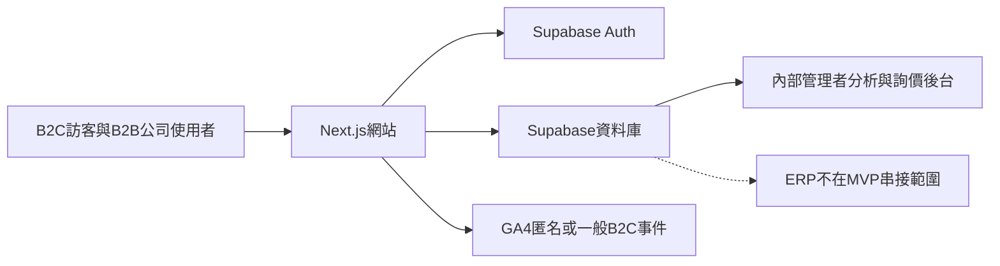
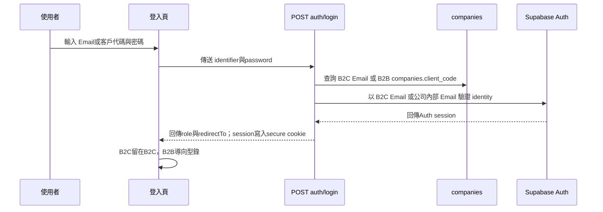

# 元家企業／宅鮮配整合網站 MVP v4.1

## Functional & Technical Design Document

文件版本：第四版增補（MVP v4.1）
文件日期：2026-09-02
技術基準：Next.js、TypeScript、Supabase
Feature Complete：2026-09-10

本次修訂重點：同步 MVP v4.1 的路由、Auth、B2B Analytics schema 與 Admin 維護規則；Admin 建立企業會員時直接輸入完整 `client_code`；B2B session 由伺服器阻擋所有 B2C 商品、購物車與結帳路徑；前綴規則只由 migration／seed 維護；`/faq` 與 `/media` 列入 MVP 核心；記錄學生專題對 Supabase Auth 洩漏密碼防護 warning 的忽略決策。

---

## 1. 實作總覽

### 1.1 架構目標

- 使用單一 Next.js 專案承載 B2C 公開入口、B2B 私有專區與內部管理後台。
- 根目錄為 B2C；B2B 使用 /business；管理者使用 /admin。
- `/faq` 與 `/media` 為 B2C MVP 的公開核心內容頁。
- 使用同一 Supabase 專案，但以資料表與 RLS 隔離 B2C、B2B、分析與管理資料。
- B2B 公司使用一個 Auth identity 搭配公司共用密碼。
- B2B 對外只使用 `Z/E/W`＋6 碼數字客戶代碼與公司共用密碼；Supabase Auth 的 Email 僅作伺服器端內部 identity。
- Admin 前端只發起建立企業帳號；`auth.admin.createUser` 與 `companies` 寫入均在伺服器端完成，並在第二步失敗時清理剛建立的 Auth user。
- 網站不與 ERP API、ERP 資料庫或 ERP 檔案交換流程串接。
- 網站只保存網站功能必要資料，不保存 ERP 客戶名單、採購明細、成本、底價或成交資料。

### 1.2 技術組成

| 層級 | MVP 方案 |
|---|---|
| 前端與路由 | Next.js App Router、TypeScript |
| UI | CSS／現有元件、mobile-first、少量微互動 |
| 身分驗證 | Supabase Auth；B2B 一家公司一個 identity |
| 資料庫 | Supabase PostgreSQL |
| 權限 | PostgreSQL RLS 加伺服器端驗證 |
| 分析 | Supabase analytics_events 加 GA4 基礎追蹤 |
| 圖片 | 代表性展示圖片；不承諾防截圖 |
| 部署 | MVP 使用單一 Web deployment 與單一 Supabase 專案 |

### 1.3 系統邊界

網站資料庫與 ERP 分離，代表網站可以保存詢價與網站行為，但不代表網站可以提供真實銷售額或 ERP 交易分析。

## 2. 路由、角色與權限

### 2.1 路由表

| 路由 | 內容 | 未登入 | B2C | B2B 公司 | Admin |
|---|---|---|---|---|---|
| / | B2C 首頁 | 允許 | 允許 | 導回 /business | 允許 |
| /products | B2C 商品列表 | 允許 | 允許 | 伺服器阻擋並導向 /business | 允許 |
| /products/categories/[slug] | B2C 分類產品列表 | 允許 | 允許 | 伺服器阻擋並導向 /business | 允許 |
| /products/[slug] | B2C 商品詳情 | 允許 | 允許 | 伺服器阻擋並導向 /business | 允許 |
| /products/tags/[slug] | B2C 標籤產品列表 | 允許 | 允許 | 伺服器阻擋並導向 /business | 允許 |
| /cart | B2C 購物車 | 允許 | 允許 | 伺服器阻擋並導向 /business | 允許展示 |
| /checkout | B2C 結帳（建立模擬訂單） | 允許 | 允許 | 伺服器阻擋並導向 /business | 允許展示 |
| /faq | FAQ 公開內容 | 允許 | 允許 | 允許 | 允許 |
| /media | 媒體公開內容 | 允許 | 允許 | 允許 | 允許 |
| /business | B2B 專區入口 | 導向登入 | 返回 B2C | 導向型錄 | 不使用 |
| /business/catalog | 私有型錄 | 導向登入 | 拒絕 | 允許 | 不使用 |
| /business/product-finder | B2B 需求篩選器 | 導向登入 | 拒絕 | 允許 | 不使用 |
| /business/rfq | 詢價籃與已送出資料 | 導向登入 | 拒絕 | 允許自己的公司資料 | 後台查看 |
| /business/lead | 公開企業合作表單 | 允許 | 允許 | 不從 B2B 導覽進入 | 允許展示 |
| /admin | 內部管理後台 | 拒絕 | 拒絕 | 拒絕 | 允許 |
| /admin/business | B2B 管理後台捷徑，預設開啟型錄頁籤 | 拒絕 | 拒絕 | 拒絕 | 允許 |

### 2.2 角色定義

- B2C：以 Email identity 登入或使用匿名購物流程。
- B2B：以使用者輸入的客戶代碼對應 `companies.client_code`，再登入該公司的 Supabase Auth identity。
- Admin：MVP 使用固定展示管理者帳號；所有 Admin API 由伺服器驗證 `app_admins` 與啟用狀態。正式版再替換為完整內部管理者權限。
- B2B 不建立 company_users 個人登入模型。
- B2C 需求釐清工具以 B2C layout 中的浮動元件呈現，不建立獨立可索引路由。
- B2B 需求篩選器是登入後私有路由；管理者不以 B2B session 使用。

## 3. 身分驗證與 Session

### 3.1 登入流程

### 3.2 B2B 公司級身份

- `companies.auth_user_id` 對應唯一 Supabase Auth user；資料庫唯一限制禁止同一 user 綁定多家公司。
- `companies.client_code` 為公司對外登入識別碼，不是個人帳號，格式為 `^[ZEW][0-9]{6}$`。
- 公司內多人共用客戶代碼與密碼。
- B2B 使用者不輸入 Supabase Auth Email。登入 API 先依 `client_code` 找到公司，再由伺服器依 `auth_user_id` 取得內部 Email，最後使用 Supabase Auth password flow 驗證。
- Admin 建立企業帳號時輸入完整客戶代碼；伺服器正規化、驗證 `^[ZEW][0-9]{6}$` 與唯一性，再以 `auth.admin.createUser` 建立已確認的 Auth user 並寫入 `companies`；Auth user 建立成功但公司資料寫入失敗時，伺服器刪除剛建立的 Auth user，避免孤兒 identity。
- 公司停用時，伺服器拒絕登入與後續資料存取。
- Admin 目前可設定建立時的初始密碼，以及啟用／停用公司；前端尚未提供密碼重設按鈕。
- 不提供企業端自助註冊、忘記密碼或個人帳號；正式上線前需補管理者重設或企業聯絡 Email 復原流程。
- 共用身份無法判斷個別使用者；B2B 事件以公司為主要分析單位，保存伺服器衍生的 `company_id`、`actor_user_id`、`session_id` 與完整代碼快照，但不在報表或 CSV 展示個別公司與完整代碼。

### 3.3 Session 安全規則

- 正式實作使用 Supabase Auth session 與 secure cookie。
- 前端不可自行設定 role、company_id、tier 或 channel。
- 對 B2B 資料的所有讀寫都在伺服器驗證 session 與公司狀態。
- `service_role`／secret key 只能存在伺服器環境變數；不得出現在瀏覽器或 `NEXT_PUBLIC_` 變數。
- Session 過期、公司停用或 Auth 失敗時清除本地狀態並顯示一般錯誤訊息。

## 4. 資料模型

### 4.1 companies

| 欄位 | 型別 | 說明 |
|---|---|---|
| id | uuid | 主鍵 |
| auth_user_id | uuid nullable unique | 對應公司 Auth identity；未設定時不可完成 B2B 登入；同一 user 不可綁定多家公司 |
| client_code | text unique | 公司登入識別碼；格式為 `^[ZEW][0-9]{6}$` |
| name | text | 公司名稱，僅內部使用 |
| is_active | boolean | 是否可登入 |
| created_at | timestamptz | 建立時間 |
| updated_at | timestamptz | 更新時間 |

MVP 不保存個別採購、門市或分店使用者資料。

### 4.2 customer_prefix_rules

| 欄位 | 型別 | 說明 |
|---|---|---|
| id | uuid | 主鍵 |
| prefix | text unique | 客戶代碼前綴 |
| tier_label | text | 客戶級距標籤 |
| channel_label | text | 通路標籤 |
| is_active | boolean | 是否套用 |
| created_at | timestamptz | 建立時間 |
| updated_at | timestamptz | 更新時間 |

規則只由 migration／seed 建立與更新，Admin 不提供前綴規則 CRUD 或管理頁籤。MVP 採用展示規則：Z＝月營業額 20 萬以下、E＝月營業額 50 萬以下、W＝其他；沒有匹配前綴時，tier_label 與 channel_label 為未分類。這些是展示用分級標籤，不由網站推論實際營業額區間。表名沿用 migration 的 `customer_prefix_rules`。

### 4.3 b2b_products

| 欄位 | 型別 | 說明 |
|---|---|---|
| id | uuid | 主鍵 |
| product_code | text | 企業型錄產品編號 |
| name | text | 產品名稱 |
| brand | text | 品牌 |
| category | text | B2B 分類 |
| specification | text | 規格 |
| packaging | text nullable | 包裝資訊 |
| origin | text | 來源／產地 |
| storage_method | text | 保存方式 |
| description | text | 採購型描述 |
| image_path | text nullable | 圖片路徑或資源識別 |
| is_active | boolean | 是否出現在型錄 |
| created_at | timestamptz | 建立時間 |
| updated_at | timestamptz | 更新時間 |

B2B MVP 不存價格。

### 4.3.1 B2B 標籤資料

B2B 與 B2C 產品線的包裝、規格與用途不同，因此使用獨立的標籤表與產品關聯，不共用實際標籤資料。MVP 不建立獨立 tag group 表，群組直接保存在 `group_name`。

**b2b_tags**

| 欄位 | 型別 | 說明 |
|---|---|---|
| id | uuid | 主鍵 |
| group_name | text | 標籤群組名稱，例如食材、加工／規格、用途、保存／包裝 |
| slug | text | 標籤 URL／查詢識別 |
| name | text | 標籤名稱 |
| is_active | boolean | 是否可套用 |
| created_at | timestamptz | 建立時間 |
| updated_at | timestamptz | 更新時間 |

**b2b_product_tags**

| 欄位 | 型別 | 說明 |
|---|---|---|
| product_id | uuid | 對應 b2b_products |
| tag_id | uuid | 對應 b2b_tags |

`(product_id, tag_id)` 為複合主鍵。標籤定義由開發團隊以種子資料建立，管理後台只能套用或移除既有標籤。

### 4.4 b2b_rfqs

| 欄位 | 型別 | 說明 |
|---|---|---|
| id | uuid | 主鍵 |
| company_id | uuid | 詢價所屬公司 |
| customer_tier_snapshot | text | 送出當下的級距 |
| channel_snapshot | text | 送出當下的通路 |
| status | text | 新建／處理中／已結案 |
| total_note | text nullable | 詢價總備註 |
| created_at | timestamptz | 送出時間 |
| updated_at | timestamptz | 更新時間 |

不保存報價金額、成交金額、業務指派或業務接洽紀錄。

### 4.5 b2b_rfq_items

| 欄位 | 型別 | 說明 |
|---|---|---|
| id | uuid | 主鍵 |
| rfq_id | uuid | 對應詢價單 |
| product_id | uuid | 對應 B2B 商品 |
| quantity | numeric | 需求數量 |
| unit | text | 箱／包／盒／公斤等 |
| item_note | text nullable | 品項備註 |
| created_at | timestamptz | 建立時間 |
| updated_at | timestamptz | 更新時間 |

MVP 不保存產品編號或名稱 snapshot；後台依 `product_id` 讀取目前型錄資料。

### 4.6 b2c_products

| 欄位 | 型別 | 說明 |
|---|---|---|
| id | uuid | 主鍵 |
| slug | text unique | 商品 URL |
| name | text | 商品名稱 |
| brand | text | 品牌 |
| category | text | B2C 分類 |
| specification | text | 消費者規格／包裝描述 |
| price | numeric | 展示台幣價格 |
| mock_inventory | integer | 模擬庫存 |
| origin | text | 產地／來源 |
| storage_method | text | 保存方式 |
| food_safety_info | text nullable | 食品安全資訊 |
| quality_info | text nullable | 認證／品質資訊 |
| description | text | 消費者描述 |
| image_path | text nullable | 圖片路徑或資源識別 |
| is_active | boolean | 是否上架 |
| created_at | timestamptz | 建立時間 |
| updated_at | timestamptz | 更新時間 |

### 4.6.1 B2C 標籤資料

B2C 使用獨立標籤表，供公開商品詳情、標籤產品列表與需求釐清工具使用。MVP 不建立獨立 tag group 表，群組直接保存在 `group_name`。

**b2c_tags**

| 欄位 | 型別 | 說明 |
|---|---|---|
| id | uuid | 主鍵 |
| group_name | text | 標籤群組名稱，例如食材、料理方式、需求特性、加工方式 |
| slug | text | 標籤 URL／查詢識別 |
| name | text | 標籤名稱 |
| is_active | boolean | 是否可套用 |
| created_at | timestamptz | 建立時間 |
| updated_at | timestamptz | 更新時間 |

**b2c_product_tags**

| 欄位 | 型別 | 說明 |
|---|---|---|
| product_id | uuid | 對應 b2c_products |
| tag_id | uuid | 對應 b2c_tags |

`(product_id, tag_id)` 為複合主鍵。標籤定義由開發團隊以種子資料建立，管理後台只能套用或移除既有標籤。

### 4.6.2 固定需求篩選設定

B2C 與 B2B 的問題流程分開，以版本控制的固定設定檔／種子資料保存，不建立問卷管理資料表或後台編輯器。

每個選項至少包含：

- flow：`b2c` 或 `b2b`。
- step：步驟順序。
- question：問題文字。
- option_key、option_label：選項識別與顯示文字。
- condition_type、condition_value：對應分類、標籤、規格或保存條件。
- is_optional：是否可略過。

篩選時將多個答案轉為條件，採 AND「全部符合」。條件結果由資料庫查詢 active 商品，不保存使用者答案。

### 4.7 b2c_orders 與 b2c_order_items

b2c_orders 保存 id、status、recipient_name、recipient_phone、recipient_email、delivery_address、privacy_consent_at、created_at 與 updated_at。status 限定為已建立、處理中、已完成。

b2c_order_items 保存 id、mock_order_id、product_id、quantity、unit_price、created_at。雖然父表已依 FDD 更名為 `b2c_orders`，明細表的外鍵欄位仍沿用 migration 的 `mock_order_id`。

訂單總額不保存於資料表，由後台或伺服器依明細的 `quantity × unit_price` 即時計算。MVP 不保存產品名稱 snapshot 或 line_total。

MVP 的 B2C 訂單為展示資料，不代表真實銷售資料。

### 4.8 analytics_events

| 欄位 | 型別 | 說明 |
|---|---|---|
| id | uuid | 主鍵 |
| event_name | text | 允許的事件名稱 |
| surface | text | 事件發生的網站面向 |
| product_reference | uuid nullable | 相關產品 |
| product_category | text nullable | 事件當下分類 |
| product_brand | text nullable | 事件當下品牌 |
| customer_tier_snapshot | text nullable | B2B 級距快照 |
| channel_snapshot | text nullable | B2B 通路快照 |
| occurred_at | timestamptz | 事件時間 |

不保存姓名、電話、Email、完整客戶代碼、IP、company_id、匿名 session 或 metadata。

本節欄位以目前 Supabase migration 為唯一實作依據。未來如需新增欄位，必須建立新的 migration，不在 API 或前端自行假設欄位存在。

> **本節僅保留 v2.2（2026-08-17）原始設計，作為歷史對照。實作現況請一併參照
> 下方 4.8.1，該節已依 2026-08-30 三人共識更新 `analytics_events` 實際欄位。**

### 4.8.1 分析報表擴充（2026-08-30 共識變更）

C 在既有 `analytics_events` 之上，為 B2B 行為分析報表新增下列欄位與資料表，並經
A／B／C 三人複核後套用至正式 Supabase（migration
`20260830175215_b2b_analytics_reporting.sql`）。本節文字取代並補充 4.8 原始設計中
「不保存...company_id、匿名 session 或 metadata」與「本節欄位以目前 Supabase
migration 為唯一實作依據」兩句對後續變更的限制——本次變更本身即依規定另立新
migration，符合原條款的變更程序。

**`analytics_events` 新增欄位**

| 欄位 | 型別 | 說明 |
|---|---|---|
| actor_user_id | uuid nullable，references auth.users | B2B 事件的操作者 Auth identity；B2C 事件必須為 null |
| company_id | uuid nullable，references companies | B2B 事件所屬公司；B2C 事件必須為 null |
| session_id | text nullable（1–128 字） | 伺服器產生的第一方 session cookie 值；30 分鐘無事件後過期；B2C 事件必須為 null |
| customer_code_snapshot | text nullable，格式 `^[ZEW][0-9]{6}$` | 事件當下的完整客戶代碼快照；只用於伺服器端報表計算，不進入 CSV 匯出或前端 |
| event_data | jsonb，`not null default '{}'` | 白名單驗證過的結構化事件參數（例如 `filter_type`、`selected_option_ids`、`question_key`、`option_id`、`product_id`、`rfq_id`），取代原先「不保存 metadata」的限制；型別以 `check (jsonb_typeof(event_data) = 'object')` 限制必須是物件 |

新增 `analytics_events_b2c_identity_empty` 檢查約束：`surface <> 'b2b'` 時，
`actor_user_id`／`company_id`／`session_id`／`customer_code_snapshot` 皆須為
`null`，確保 B2C 事件維持原設計的匿名化程度，只有 B2B 事件才記錄上述身份欄位。

**新增資料表：`analytics_export_audits`**

| 欄位 | 型別 | 說明 |
|---|---|---|
| id | uuid | 主鍵 |
| admin_user_id | uuid，references auth.users | 執行匯出的管理者 |
| purpose | text，限定 `operations_analysis`／`customer_service`／`audit`／`other` | 下載用途，下載前必填 |
| note | text nullable | 下載備註，最長 500 字 |
| query_scope | jsonb | 本次查詢的日期範圍、篩選條件快照 |
| file_format | text，固定 `csv` | 匯出格式 |
| row_count | integer | 匯出的聚合列數 |
| created_at | timestamptz | 稽核時間 |

只有 service role 可讀寫；RLS 對 `public`／`anon`／`authenticated` 全部撤銷讀寫權限。

**對應 API 與行為**

- `GET /api/admin/analytics/summary`：只回傳 PostgreSQL 聚合結果，不回傳原始事件；篩選欄位跨欄位採 AND、同欄多選採 OR；少於 5 家公司的分組回傳「其他（已遮罩）」。
- `GET /api/admin/analytics/export`：下載前需先填 `purpose`（必要）與可選 `note`，成功下載會寫入一筆 `analytics_export_audits`；只輸出聚合列，不輸出原始事件、完整客戶代碼或公司明細。
- 原始事件與 `customer_code_snapshot` 保留 24 個月，由 `public.cleanup_old_analytics_events()` 搭配 `pg_cron`（可用時，任務名 `yuanjia_analytics_retention`，排程 `0 3 1 * *`）每月自動清理；`pg_cron` 未啟用的環境需由外部排程呼叫同一函式。

**與原設計的差異，供未來查核使用**

- 4.8 原文「不保存...company_id、匿名 session 或 metadata」僅適用於 B2C 事件；B2B
  事件依本節新增欄位保存服務端衍生的身份與行為資料，且明確不含姓名、電話、
  Email、IP、完整瀏覽器指紋或 User-Agent。
- 詳細規則與驗收標準另見 `docs/database-plan.md`「C：後台／分析／整合」第
  C5 節（事件隱私與行為分析），本節為 FDD 端的對應紀錄。

## 5. Supabase 與 RLS

### 5.1 RLS 權限矩陣

| 資料表 | anon | B2C | B2B 公司 | Admin server |
|---|---|---|---|---|
| companies | 不可讀 | 不可讀 | 只能讀自己的公司基本資料 | 可管理 |
| customer_prefix_rules | 不可讀 | 不可讀 | 不可讀 | 僅讀取；寫入由 migration／seed 管理 |
| b2c_products | 可讀 active | 可讀 active | 不使用 | 可管理 |
| b2b_products | 不可讀 | 不可讀 | 可讀 active | 可管理 |
| b2b_tags | 不可讀 | 不可讀 | 可讀 active | 可讀；不可建立定義 |
| b2b_product_tags | 不可讀 | 不可讀 | 可讀 active 關聯 | 可讀／套用／移除 |
| b2c_tags | 可讀 active | 可讀 active | 不使用 | 可讀；不可建立定義 |
| b2c_product_tags | 可讀 active 關聯 | 可讀 active 關聯 | 不使用 | 可讀／套用／移除 |
| b2b_rfqs | 不可讀 | 不可讀 | 只能讀／建立自己公司 | 可讀／更新 |
| b2b_rfq_items | 不可讀 | 不可讀 | 只能透過自己公司的 RFQ | 可讀 |
| b2c_orders | 不直接寫入 | 走 server route | 不使用 | 可讀／更新 |
| b2c_order_items | 不直接寫入 | 走 server route | 不使用 | 可讀 |
| analytics_events | 不直接寫入 | 走 server route | 走 server route，不可讀 | 可讀 |

### 5.2 B2B 授權判斷

B2B 存取必須同時滿足：

1. request 有效 authenticated session。
2. session user id 對應 companies.auth_user_id。
3. companies.is_active 為 true。
4. 目標 RFQ.company_id 等於目前公司的 company_id。
5. 產品為 active。

### 5.2.1 標籤資料權限

- `b2c_tags` 的 active 標籤與 active `b2c_product_tags` 可供公開商品頁與標籤頁讀取；群組由 `group_name` 表示。
- `b2b_tags` 的 active 標籤與 active `b2b_product_tags` 只能由有效 B2B session 讀取；群組由 `group_name` 表示。
- 前台不可建立、修改或刪除標籤定義。
- Admin server 只能更新產品與既有標籤的關聯；不得由 API 建立新標籤。
- B2B 標籤查詢不回傳給匿名使用者、B2C 使用者或 GA4。

### 5.3 分析事件授權

- Request 只接受白名單 `event_name`、可選 `product_id` 與依事件允許的 `event_data`；不接受 `actor_user_id`、`company_id`、級距、通路、完整客戶代碼或個人資料。
- 伺服器由 request 面向與路由推導 `surface`，再依登入 session、公司與 `customer_prefix_rules` 填入 `actor_user_id`、`company_id`、`session_id`、`customer_code_snapshot`、`customer_tier_snapshot` 與 `channel_snapshot`。
- 產品、分類、品牌與 RFQ／Finder 參照由伺服器驗證並填入；B2B `event_data` 只保存白名單結構化欄位，B2C 事件的身份欄位與 `event_data` 維持空值／空物件。
- 原始 `analytics_events` 對匿名、B2C、B2B 使用者均不可讀；Admin 只透過再次驗證 `admin` session 的資料庫聚合與匯出 API 讀取，CSV 不輸出原始事件、完整代碼或個別公司。

## 6. API 設計

### 6.1 POST /api/auth/login

用途：統一 B2C Email 或 B2B 客戶代碼登入。

Request：

- identifier：Email 或客戶代碼。
- password：密碼。

伺服器行為：

- 先判斷 identifier 是否為 B2C Email 或有效 B2B `companies.client_code`。
- B2B 查詢公司 identity，不接受前端指定 company_id。
- 驗證 Auth 與公司 is_active。
- 回傳 `role` 與 `redirectTo`；Auth session 由伺服器端 client 寫入 secure cookie，B2B company context 由後續伺服器請求依 session 解析，不由前端提交。

錯誤：

- 使用一般化登入失敗訊息，不透露帳號是否存在。
- 停用公司不可建立有效 session。

### 6.2 POST /api/b2b/rfqs

用途：建立 B2B 詢價單。

Request：

- items：至少一筆 product_id、quantity、unit、item_note。
- total_note：詢價總備註。

伺服器驗證：

- 必須是有效 B2B session。
- items 不可為空。
- product_id 必須存在且 active。
- quantity 必須大於 0。
- unit 必須為允許值。
- company_id、customer_tier_snapshot 與 channel_snapshot 不接受前端指定。
- 由公司 `client_code` 與前綴規則推導分類。

Success：HTTP 201，回傳 rfqId 與新建狀態。

### 6.3 POST /api/b2c/mock-orders

用途：由「結帳」頁建立 MVP 展示用模擬訂單；API 路徑保留 `mock-orders` 技術命名。

伺服器驗證：

- recipient_name、recipient_phone、recipient_email、delivery_address 與 privacy_consent_at 不可為空。
- items 不可為空。
- 商品必須存在且 active。
- 總額由伺服器依 `quantity × unit_price` 重新計算，但不寫入 `b2c_orders`。
- 不串金流、物流或 ERP。

Success：HTTP 201，回傳展示訂單編號與已建立狀態。

### 6.4 產品標籤查詢

**GET `/api/b2c/products?tag=slug`**

- 公開回傳 active B2C 商品與其公開標籤。
- 支援 `tag` 單一標籤與 `tags` 多標籤查詢。
- 多個標籤採 AND「全部符合」。
- B2C 標籤群組以 `b2c_tags.group_name` 回傳。
- 無符合商品回傳空陣列，由頁面顯示「無符合商品」。
- 不回傳 B2B 產品、B2B 標籤或企業資料。

**GET `/api/b2b/products?tag=slug`**

- 必須通過有效 B2B session。
- 只回傳 active B2B 產品，不回傳價格。
- 支援關鍵字、分類、品牌、產品編號與多標籤 AND 查詢。
- B2B 產品不使用 slug，產品詳情以 `id` 或 `product_code` 識別。
- 標籤群組以 `b2b_tags.group_name` 回傳。

**PATCH `/api/admin/products/{channel}/{productId}/tags`**

- 僅管理者可使用。
- `channel` 只允許 `b2c` 或 `b2b`。
- Request 只接受既有 tag_id 陣列，更新產品與標籤的關聯。
- 伺服器拒絕不存在、停用或跨 B2C／B2B 的標籤。
- 不提供建立、修改或刪除標籤定義的 API。

### 6.5 固定需求篩選器

需求篩選器使用前端固定設定檔與既有標籤／分類資料，不建立問卷 CRUD API。

**GET `/api/b2c/product-finder?conditions=...`**

- 公開使用，只查詢 active B2C 商品。
- `conditions` 必須通過白名單驗證，映射為 B2C 分類或標籤條件。
- 多條件使用 AND；回傳 0、1 或多筆產品結果。

**GET `/api/b2b/product-finder?conditions=...`**

- 必須通過有效 B2B session。
- `conditions` 必須通過 B2B 題組白名單驗證。
- 回傳 active B2B 型錄結果，不回傳價格。
- 多筆結果回到型錄列表；單筆結果由型錄顯示產品詳情狀態。

流程規則：

- B2C 固定四步：料理方式、需求特性、產品類型、其他偏好（可選）。
- B2B 固定四步：產品類型、產品型態、使用情境、規格／保存條件（可選）。
- 支援返回、重新開始與空結果狀態「無符合商品」。
- 答案不保存為個人資料；只保存面向、產品、分類、品牌、級距與通路等事件欄位，不保存公司識別或匿名 session。

### 6.6 B2C 浮動工具

- 元件名稱：`B2CHelpWidget`。
- 只掛載於 B2C 公開 layout，右下角固定顯示。
- 展開後提供 Line@ 固定外部連結、需求篩選器與固定 AI 示範。
- 固定 AI 示範使用本地設定的預設問題與回答，不串接 AI API、不保存對話、不允許任意輸入。
- 對話框需要可關閉、可鍵盤操作、可被螢幕閱讀器辨識。
- B2B、`/business/*` 與 `/admin` 不掛載此元件。

### 6.7 POST /api/analytics/events

用途：保存 B2B 與 B2C 允許事件。

允許 event_name：

- b2b_login_success
- b2b_catalog_view
- b2b_product_view
- b2b_search_filter
- b2b_product_finder_start
- b2b_product_finder_answer
- b2b_product_finder_complete
- b2b_product_finder_result_click
- b2b_rfq_add
- b2b_rfq_submit
- b2c_product_view
- b2c_search_category
- b2c_tag_click
- b2c_tag_view
- b2c_help_widget_open
- b2c_product_finder_start
- b2c_product_finder_answer
- b2c_product_finder_complete
- b2c_product_finder_result_click
- b2c_line_click
- b2c_ai_demo_open
- b2c_cart_add
- b2c_checkout_start
- b2c_mock_order_created

Request 與伺服器規則：

- Request 只接受白名單內的 `event_name`、可選 `product_id` 與依事件允許的 `event_data`；不接受 `actor_user_id`、`company_id`、級距、通路、完整客戶代碼、姓名、電話或 Email。
- `surface` 由伺服器依路由與登入狀態決定。
- B2B 由 session 與 `customer_prefix_rules` 推導 `actor_user_id`、`company_id`、`session_id`、`customer_code_snapshot`、`customer_tier_snapshot` 與 `channel_snapshot`；B2C 事件的這些欄位必須為 `null`。
- `product_reference`、`product_category` 與 `product_brand` 由伺服器依產品資料填入，不信任前端傳入的分類或品牌；RFQ、Finder 選項與篩選值也由伺服器驗證。
- `b2b_search_filter` 的 `event_data` 為 `filter_type`（`keyword`／`category`／`brand`／`tag`）、最多 20 個不重複 `selected_option_ids` 與 0–1,000,000 的 `result_count`；keyword 不帶選項，其餘類型至少一個選項。
- `b2b_product_finder_answer` 保存 `question_key` 與 `option_id`；`b2b_product_finder_result_click`／`b2b_rfq_add` 保存 `product_id`；`b2b_rfq_submit` 保存 `rfq_id`。其他 B2B 事件使用空物件，B2C 事件不接受額外資料。
- 伺服器以 `yuanjia_analytics_session` 設定隨機第一方 Cookie，30 分鐘有效，使用 `HttpOnly`、`SameSite=Lax`，正式環境啟用 `Secure`；有效事件回傳 HTTP 201，無效資料回傳 400。

### 6.8 GET /api/admin/analytics/summary

用途：回傳管理者分析摘要。

支援篩選：

- date_from、date_to。
- customer_tier_snapshot。
- channel_snapshot。
- product_reference。
- product_category。
- product_brand。
- event_name。
- filter_type。
- finder_question。

篩選規則：日期以台北時間計算，預設近 90 日，最長 24 個月；不同欄位採 AND，同欄位多選採 OR，`surface` 固定為 `b2b`。資料庫 RPC `admin_b2b_analytics_summary` 負責聚合，API 不載入原始事件，聚合列最多 10,000 筆。

回傳：

- 事件總數、活躍公司、活躍使用者、活躍 session 與平均每活躍公司事件數。
- B2B 型錄與產品查看次數。
- B2B Finder 題目／選項、主漏斗與 Finder 漏斗。
- 各產品行為排行與 RFQ 統計；RFQ 實際筆數、品項與數量由 `b2b_rfqs` 彙總。
- 趨勢、級距與通路比較；群組少於 5 家不重複公司時併入「其他（已遮罩）」。

`GET /api/admin/analytics/export` 使用相同查詢條件，必填 `purpose`（`operations_analysis`／`customer_service`／`audit`／`other`），可選 500 字 `note`；只輸出聚合 CSV，並在成功下載前寫入 `analytics_export_audits`，保存管理者、時間、用途、查詢範圍、格式與筆數。單次讀取完整 `customer_code_snapshot` 不另留稽核紀錄。

### 6.9 前綴規則資料

資料表：`customer_prefix_rules`

- 目前由 migration／種子資料建立 Z、E、W 規則。
- Admin 企業清單 API 會讀取啟用規則，將前綴轉為級距與通路顯示。
- 沒有獨立的前綴規則管理頁籤或 CRUD API；規則建立與更新只走受控 migration／seed 流程。
- 規則異動不得回寫歷史事件；事件與詢價保留建立當下的 `customer_tier_snapshot` 與 `channel_snapshot`。

### 6.10 Admin 商品上下架 API

**GET `/api/admin/products/{channel}`**

- 僅啟用的 Admin 可使用；`channel` 只允許 `b2c` 或 `b2b`。
- `include_inactive=true` 時回傳上架與下架商品，供管理列表使用。
- 支援 `q` 搜尋；B2C 搜尋名稱／品牌／分類，B2B 另支援產品編號。

**PATCH `/api/admin/products/{channel}/{productId}`**

- 僅 Admin 可使用，Request 為 `{ "is_active": boolean }`。
- B2C 更新 `b2c_products.is_active`；B2B 更新 `b2b_products.is_active`。
- 下架只改變可見性，不刪除商品、標籤關聯或歷史資料。
- 前台 B2C、B2B 型錄與需求篩選 API 均只回傳 active 商品。

### 6.11 Admin B2C 展示訂單 API

沿用 `/api/b2c/mock-orders`，依登入角色分隔操作：

- POST：未登入訪客或 B2C 使用者建立展示訂單；B2B 與 Admin 拒絕建立。
- GET：僅 Admin 讀取訂單、收件資訊與品項，可依 status 篩選。
- PATCH：僅 Admin 更新 `order_id` 與 `status`；狀態為 `created`、`processing`、`completed`。
- 後台即時計算品項總額；資料庫不保存訂單總額、產品名稱 snapshot 或 line_total。
- 這些訂單是展示／流程驗證資料，不代表正式金流、物流或出貨作業。

### 6.12 Admin B2B 企業會員 API

**GET／POST `/api/admin/companies`**

- GET：僅 Admin 讀取企業清單、客戶代碼、企業名稱、前綴級距、建立時間與啟用狀態。
- POST Request：`name`、完整 `client_code`、`password`（8–72 字元）。
- POST 由伺服器將 `client_code` 正規化為大寫，驗證格式 `^[ZEW][0-9]{6}$` 與唯一性；不自動產生或補號。
- 伺服器使用內部 Email 呼叫 Supabase Auth Admin API 建立已確認 user，再插入 `companies`；成功回傳客戶代碼，不回傳或保存明文密碼。
- `companies` 寫入失敗時刪除本次剛建立的 Auth user，避免孤兒 identity。

**PATCH `/api/admin/companies/{companyId}`**

- 僅 Admin 可使用。
- 目前接受 `name` 與 `is_active`；停用不刪除公司、Auth user 或詢價紀錄。
- 目前不提供密碼重設 API；若需重設，必須另行建立受控的 Admin reset 流程。

**Dashboard 手動建帳例外流程**

- 可在 Supabase Dashboard 建立 Auth user，但必須取得該 user 的新 UUID，再新增或更新 `companies`。
- 同一 `auth_user_id` 只允許對應一家公司；重複插入會觸發 `companies_auth_user_id_key`。
- 一般營運不採用此流程，避免 Auth user、客戶代碼與公司資料不同步。

### 6.13 Admin B2B 詢價 API

**GET／PATCH `/api/admin/rfqs`**

- GET：僅 Admin 讀取所有企業詢價、公司客戶代碼、企業名稱、品項與級距／通路快照，可依 status 篩選。
- PATCH：僅 Admin 更新詢價狀態；狀態為 `new`、`processing`、`closed`。
- 不提供報價金額、業務指派、CRM 或成交結果欄位。

### 6.14 B2B 新客表單

MVP 不建立公開寫入 API。前端只做欄位驗證與成功畫面，不保存姓名、電話或 Email。

## 7. 頁面與元件

### 7.1 共用元件

| 元件 | 責任 |
|---|---|
| Header | 品牌、目前區域、登入狀態、購物車或企業導覽 |
| LoginForm | Email／客戶代碼與密碼輸入、錯誤狀態 |
| ProductCard | B2C 價格購物卡或 B2B 詢價卡 |
| ProductDetail | 商品規格、產地、保存、品質與主要操作 |
| BusinessGuard | 判斷 B2B session 與路由權限 |
| AdminGuard | 判斷管理者 session |
| B2CHelpWidget | B2C 全站右下角浮動工具、Line@、固定篩選器與 AI 示範 |
| ProductTagList | 顯示產品標籤，處理標籤點擊與結果導向 |
| ProductFinder | 顯示固定問題步驟、返回／重新開始與篩選結果 |
| StatusMessage | loading、成功、空資料與錯誤提示 |
| AdminDashboard | Admin 單頁工作台、B2C／B2B 商品上下架、B2C 訂單、企業會員與 B2B 詢價頁籤 |

### 7.2 B2C 頁面

| 頁面 | 功能與狀態 |
|---|---|
| / | Hero、分類、品牌、食安、品質、企業合作入口 |
| /faq | 常見問題與使用說明；MVP 公開核心內容 |
| /media | 媒體與品牌內容；MVP 公開核心內容 |
| /products | 搜尋、分類、列表、無結果 |
| /products/categories/[slug] | B2C 分類名稱、分類產品列表、無符合商品、SEO metadata |
| /products/tags/[slug] | B2C 標籤名稱、標籤產品列表、無符合商品、SEO metadata |
| /products/[slug] | 商品資料、產地、保存、品質、產品標籤、加入購物車 |
| /cart | 空購物車、商品清單、數量、總額、前往結帳 CTA；設定 noindex，B2B session 導向 /business |
| /checkout | H1「結帳」、表單驗證、送出中、成功與錯誤；設定 noindex，B2B session 導向 /business |
| /about | 企業與品牌內容 |
| /business/lead | 企業合作展示表單 |
| B2C 共用 layout | 所有 B2C 頁面掛載 B2CHelpWidget；B2B／Admin 不掛載 |

### 7.3 B2B 頁面

| 頁面 | 功能與狀態 |
|---|---|
| /business | B2B 導覽與登入後入口 |
| /business/catalog | 搜尋、分類、品牌、產品編號、B2B 標籤、型錄與詢價籃 |
| /business/product-finder | 固定四步 B2B 需求篩選、返回、重新開始與條件結果 |
| /business/rfq | 詢價品項、數量、單位、備註、送出成功 |

### 7.4 管理後台

| 模組 | 功能 |
|---|---|
| B2C 商品 | 讀取包含下架資料的管理清單，切換商品上架／下架 |
| B2C 訂單 | 查看展示訂單收件資訊與品項，依 `created`／`processing`／`completed` 更新狀態 |
| B2B 型錄 | 讀取包含下架資料的管理清單，切換 B2B 型錄商品上架／下架 |
| 企業會員 | 建立公司 Auth identity 與 `companies` 綁定、查看清單、啟用／停用；建立時設定初始密碼 |
| 產品標籤套用 API | 後端可從既有 B2B／B2C 標籤清單套用或移除；目前未加入 AdminDashboard 頁籤，不建立標籤定義 |
| 前綴規則 | 只由 migration／seed 建立與更新；企業清單讀取規則顯示級距，沒有 Admin CRUD 頁籤或 API |
| 詢價 | 查看所有企業詢價品項、公司與快照，更新 `new`／`processing`／`closed` 狀態 |
| 分析 | 僅提供 B2B 篩選、摘要、漏斗、產品／Finder／RFQ 統計與 CSV 匯出；B2C 分析由 GA4 負責 |
| B2B 管理捷徑 | `/admin/business` 以 B2B 型錄頁籤開啟同一個 AdminDashboard |

## 8. 分析與資料流

### 8.1 B2B 行為資料流

1. B2B 公司登入。
2. 伺服器依 `companies.client_code` 找到公司與 Auth identity。
3. 伺服器讀取 migration／seed 建立的啟用前綴規則，推導 `customer_tier_snapshot` 與 `channel_snapshot`。
4. 使用者進行型錄、產品與詢價操作。
5. 事件 API 只接收白名單事件與允許的 `event_data`，伺服器驗證產品、Finder 選項及 RFQ 所屬公司。
6. 伺服器保存 `actor_user_id`、`company_id`、`session_id`、完整 `customer_code_snapshot`、級距／通路與產品快照；完整代碼只留在伺服器事件資料，不輸出給前端或 CSV。
7. Admin API 透過 PostgreSQL 聚合資料，僅管理者可查看；Admin 另可管理商品可見性、展示訂單狀態、企業帳號與詢價狀態。

### 8.2 B2C 行為資料流

1. B2C 訪客瀏覽頁面或商品。
2. B2C 商品、購物車、結帳與模擬訂單分析由 GA4 負責；既有 server event API 僅保留相容性，B2C 事件身份欄位為 `null`，不納入 Admin B2B 報表。
3. 後台不製作 B2C 分析畫面，也不顯示收件人資料作為行為識別。

### 8.3 數據限制

- 報表是網站行為與詢價統計，不是真實銷售報表。
- 不可用網站事件推論 ERP 銷售額、毛利或業務成交率。
- 前綴規則變更後，歷史事件保留原有 customer_tier_snapshot 與 channel_snapshot。
- `analytics_events` 的 B2B 事件保存 `company_id`、`actor_user_id`、`session_id` 與完整代碼快照；報表只提供不重複公司／使用者／session 的聚合，不提供單一公司下鑽或完整代碼。
- 不刪除有效重複事件；事件總數反映使用強度，去重只用於活躍指標與漏斗，不作為原始事件清理。

## 9. SEO、GEO、響應式與無障礙

### 9.1 SEO

- 公開 B2C 頁面輸出 title、description、canonical；`/faq` 與 `/media` 為 MVP 核心且可索引。
- `/products/tags/[slug]` 使用標籤名稱產生 title、description、canonical；有 active 商品時列入 sitemap。
- 建立 sitemap 與 robots。
- B2C 需求釐清浮動工具、`/cart`、`/checkout`、B2B 型錄、B2B 需求篩選器、詢價與 admin 設定 noindex。
- 商品頁輸出 Product JSON-LD。
- 根目錄輸出 Organization JSON-LD。
- 分類頁與 B2C 標籤頁輸出 Breadcrumb JSON-LD。
- `/cart` 與 `/checkout` 不加入 sitemap 且設定 noindex；不以購物流程頁作為 SEO 目標。
- 不做舊網域正式 301、DNS 或完整搬站。

### 9.2 GEO 內容

- 使用清楚的繁體中文標題與段落。
- 商品內容包含名稱、品牌、分類、規格、產地、保存、食安與品質。
- 不承諾 AI 搜尋排名或引用結果。

### 9.3 UI 與無障礙

- mobile-first，手機完成 B2C 購物、B2B 登入、型錄與詢價。
- Tablet：640px-900px；Desktop：901px 以上。
- 表單有 visible label、錯誤訊息與鍵盤 focus。
- 狀態不能只用顏色表示。
- 支援 reduced motion。
- 不加入右鍵封鎖或防截圖腳本。

### 9.1.1 Supabase Auth 已知 warning

- `auth_leaked_password_protection` 為學生專題的已知 warning，MVP 明確列為忽略項；不修改 Auth 設定，也不宣稱正式營運安全性。若未來正式上線，再啟用並處理此防護。

## 10. Demo 帳號與種子資料

| 類型 | 帳號 | 密碼 | 登入後 |
|---|---|---|---|
| B2C | demo@yens.com.tw | demo1234 | B2C 根目錄 |
| B2B 驗收 | Z232113 | 由建立時設定 | /business/catalog |
| B2B 驗收 | E853699 | 由建立時設定 | /business/catalog |
| B2B 驗收 | W483038 | 由建立時設定 | /business/catalog |
| Admin | admin | yenadmin | /admin |

B2B 驗收帳號規則：

- 三組客戶代碼皆須為 `companies.client_code`，並各自綁定唯一、已確認的 Supabase Auth user。
- 密碼不寫入文件、不提交 Git；測試時使用 Auth 建立或 Admin 建立時設定的密碼。
- Supabase Auth 內部 Email 只供伺服器 identity 對應，不作 B2B 登入欄位。
- 若使用 Dashboard 手動建帳，不得將同一 `auth_user_id` 重複插入其他公司。

展示資料至少涵蓋蝦蟹類、魚類、貝類、軟體類、肉類與調理食品。

展示前綴規則需包含至少兩種級距與兩種通路，並有一筆未分類 fallback 案例。

種子資料另需包含：

- B2C 標籤 `group_name`：食材、料理方式、需求特性、加工方式。
- B2C 標籤範例：鮭魚、比目魚、切片、調味、煎、蒸、氣炸、少刺／無刺。
- B2B 標籤 `group_name`：食材、加工／規格、用途、保存／包裝。
- B2B 標籤範例：鮭魚、切片、切塊、調味、餐飲料理、零售販售、團膳／大量供應。
- B2C 四步固定題組與答案對應條件。
- B2B 四步固定題組與答案對應條件。
- 固定 Line@ 外部連結與 AI 示範問題／回答。

B2C 與 B2B 即使有相同顯示名稱，也建立為不同的標籤資料，不跨產品線共用關聯。

## 11. 測試規格

### 11.1 身分與權限

- B2C 登入後不進入 B2B。
- B2B 登入後導向 /business/catalog。
- B2B 開啟任一 B2C 商品、分類、標籤、商品詳情、`/cart` 或 `/checkout` 時被伺服器導回 `/business`；`/api/b2c/products` 回傳 403。
- B2C 頁面顯示 B2CHelpWidget；B2B 與 Admin 不顯示。
- B2B 開啟 /business/product-finder 時要求有效 B2B session。
- 停用公司不能登入。
- Admin 可在建立企業帳號時設定初始密碼，並可啟用／停用企業會員；目前尚未提供前端密碼重設按鈕。
- Admin 可從前端輸入完整 `client_code`，後端驗證 `^[ZEW][0-9]{6}$` 與唯一性並完成 Auth／`companies` 綁定，不自動產生代碼。
- 建立企業帳號時不會回傳明文密碼；管理者需在建立時妥善交付初始密碼。
- Admin 可啟用／停用企業會員；停用公司不能登入，但既有詢價仍可由管理者查看。
- Admin 可切換 B2C 與 B2B 商品上架／下架。
- Admin 可讀取 B2C 展示訂單並更新狀態；B2B 或 Admin 不可建立展示訂單。
- B2B 使用者不能讀取其他公司詢價。
- B2B 使用者不能讀取 analytics_events。

### 11.2 B2B 詢價

- 只有有效 B2B session 可查看型錄。
- 產品搜尋與分類篩選可用。
- B2B 標籤篩選、多標籤 AND 查詢與「無符合商品」可用。
- B2B 四步需求篩選支援返回、重新開始與結果導向，且不回傳價格。
- 空詢價不可送出。
- quantity 必須大於 0。
- 產品 inactive 時不可加入或送出。
- company_id、customer_tier_snapshot、channel_snapshot 不接受前端偽造。
- 詢價成功後可在後台查看並更新狀態。

### 11.6 Admin 管理功能

- Admin 未登入或非 `app_admins.is_active = true` 時不可讀取任何 Admin API。
- B2C 商品下架後，公開商品 API、商品頁與購物流程不可再使用該商品。
- B2B 商品下架後，B2B 型錄與需求篩選 API 不可回傳該商品。
- B2C 展示訂單 GET／PATCH 只允許 Admin；狀態只能在 `created`、`processing`、`completed` 內切換。
- 建立企業會員必須由 Admin 輸入符合 `^[ZEW][0-9]{6}$` 的完整客戶代碼，伺服器驗證唯一性，且 `auth_user_id` 不得與既有公司重複。
- Admin 啟用／停用企業會員後，下一次 B2B 登入依 `companies.is_active` 即時拒絕或允許。
- Admin B2B 詢價 GET／PATCH 只允許 Admin；狀態只能在 `new`、`processing`、`closed` 內切換。

### 11.3 分析

- 每種白名單事件可保存。
- 非白名單事件被拒絕。
- B2B 事件正確保存 surface、customer_tier_snapshot 與 channel_snapshot。
- 分析結果不宣稱可辨識單一公司或同一公司的不同瀏覽器。
- B2C 事件不包含姓名、電話、Email 或完整客戶代碼。
- 前綴規則變更不修改歷史事件快照。
- Admin 可依日期、customer_tier_snapshot、channel_snapshot、product_reference、product_category、product_brand、event_name、filter_type 與 finder_question 查詢；B2C 行為分析由 GA4 負責。

### 11.4 B2C

- 商品瀏覽、搜尋、分類與詳情可用。
- 商品頁顯示產地、保存、食安與品質資訊。
- 商品頁顯示多個 B2C 標籤；標籤頁列出所有符合商品，無結果顯示「無符合商品」。
- B2C 多標籤查詢採 AND；B2C 標籤頁可建立 metadata、canonical 與 sitemap 條件。
- 購物車加入、刪除、數量、總額與清空可用。
- 購物車下方的前往結帳 CTA 可進入 `/checkout`。
- 結帳頁使用 H1「結帳」、驗證必填欄位並保存展示用模擬訂單；API 保持 `/api/b2c/mock-orders`。
- B2C 浮動工具可開啟 Line@、固定篩選器與固定 AI 示範；篩選器支援返回、重新開始與結果導向。
- B2C 行為統計與模擬訂單不被誤標為真實銷售。

### 11.5 品質

- 錯誤登入、空資料、無結果與 API 錯誤有明確訊息。
- 公開頁 Lighthouse 行動版目標 80 分以上。
- 手機與桌機完成主要流程。
- 固定 AI 示範不呼叫外部 AI API、不保存對話；Line@ 使用固定外部連結。
- 不存在 ERP API、團購專區、客訴模組與防截圖腳本。

## 12. 三人團隊實作分工

| 成員 | 主要工作包 | 交付責任 |
|---|---|---|
| A：B2C／體驗 | B2C 頁面、商品、產品標籤頁、購物車、結帳、B2CHelpWidget、食安與品質內容、B2C 事件 | B2C 主流程、標籤流程與手機版可驗收 |
| B：B2B／資料權限 | Auth 分流、公司共用帳號、B2B 型錄、獨立標籤、B2B 需求篩選器、搜尋、詢價、schema、RLS | B2B 主流程、篩選結果與資料權限可驗收 |
| C：後台／分析／整合 | Admin、既有標籤套用、前綴規則、analytics_events、分析 API、GA4、題組／標籤種子、整合測試 | 後台分析、固定設定、測試資料與展示可驗收 |

### 12.1 新手團隊協作規則

- 三人共同先完成路由表、資料字典、事件白名單與展示帳號。
- B 的 RLS 與登入流程必須由 C 複核。
- C 的分析事件與 API 必須由 B 複核。
- A 與 C 一起驗證響應式、無障礙與 B2C 事件。
- 每個 PR 需有另一人檢查；避免單人直接合併 Auth、RLS 或資料寫入程式。
- 先做一條完整垂直流程，再擴充頁面與內容。

## 13. 實作排程

| 日期 | 重點 |
|---|---|
| 8/6-8/10 | schema、RLS、路由守衛、展示帳號、前綴規則、事件白名單 |
| 8/11-8/20 | unified login、B2B catalog、B2C 商品／標籤與基本分析事件 |
| 8/21-8/29 | 兩套需求篩選器、RFQ、購物車、結帳、admin 與分析報表 |
| 8/30-9/4 | metadata、JSON-LD、sitemap、GA4、食安內容、a11y |
| 9/5-9/9 | end-to-end test、資料驗證、Bug fix、feature freeze |
| 9/10 | feature complete 展示 |
| 9/11-9/16 | 僅 Bug、微調、效能、文件與成果排練 |

## 14. 正式版另案規劃

- ERP API 或安全檔案交換。
- 真實銷售與產品成交資料匯入。
- 個人使用者 identity 與公司內部多角色。
- B2B 企業會員密碼重設、忘記密碼與企業聯絡 Email 復原流程。
- 業務 CRM、業務指派與報價追蹤。
- 2000+ 正式資料清洗、匯入與內容治理。
- B2C 真實金流、物流、訂單與通知。
- 正式企業合作 Lead 保存。
