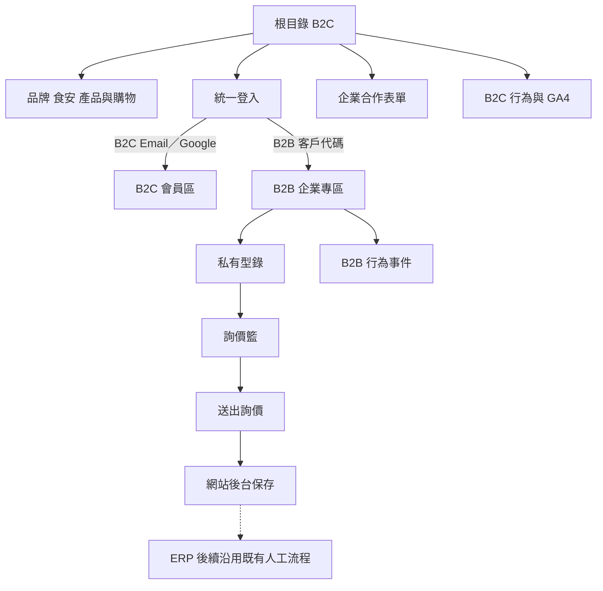
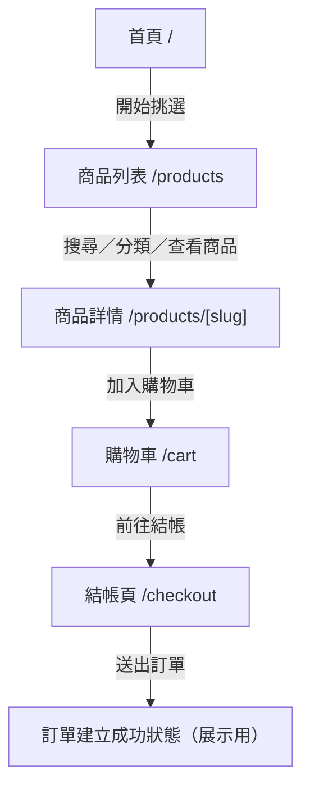
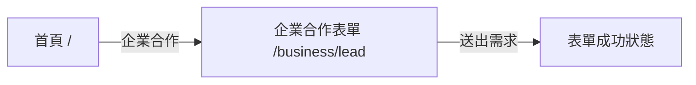
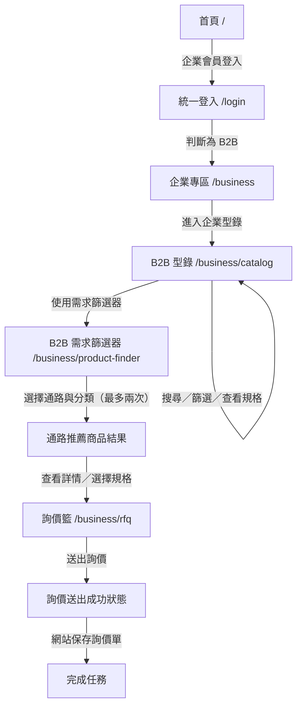

# 元家企業／宅鮮配整合網站 MVP v3.1

## Product Requirements Document

文件版本：第三版增補（MVP v3.1）
文件日期：2026-09-09
最近更新：2026-09-09（正式 MVP 路由、FDD、sitemap 與驗收契約對齊）
Feature Complete：2026-09-10
適用對象：產品負責人、三人開發團隊、展示與驗收人員

本次修訂重點：補充正式 MVP 的 B2B 內容首頁、品牌故事與企業消息路由，以及 B2C `/news`／`/media` 詳情路由；明確將首頁／型錄預覽與原型頁排除於 MVP；同步路由權限、metadata、sitemap 與驗收邊界；並保留既有的完整 `client_code`、B2B 邊界阻擋、Analytics schema、前綴規則與 Supabase Auth warning 忽略決策。

---

## 1. 產品摘要

本專案將元家企業的企業內容與產品資訊，和宅鮮配的 B2C 購物體驗，整合成單一品牌網站。根目錄固定以 B2C 為公開入口；既有企業客戶使用客戶代碼與公司共用密碼登入後，進入私有 B2B 型錄與詢價流程。

網站的 B2B 資料只保存網站必要的公司、型錄、詢價與行為資料。MVP 不與公司 ERP 串接，不保存 ERP 客戶名單、進貨明細、成本、底價或成交資料。詢價單留在網站後台，ERP 後續交接沿用公司既有流程。

### 1.1 MVP 原則

- / 是 B2C 公開首頁與主要品牌入口。
- /business 是有效 B2B session 使用的內容首頁；企業型錄仍位於 /business/catalog。
- /faq 與 /media 是 B2C MVP 的公開核心內容頁。
- /news 與 /media 的列表及詳情頁是 B2C 公開內容核心；前者發布元家第一手消息，後者整理媒體報導。
- /business/about（含 `[slug]`）與 /business/news（含分類及文章）是 B2B 登入後可用的品牌與企業消息內容。
- B2B 權限與資料歸屬以公司為單位，不追蹤個別採購、門市或分店登入者。
- B2B 型錄不顯示價格；詢價單由公司提出，後續由既有業務與企業窗口聯絡。
- B2C 著重購物體驗、食品安全、認證、品質與產地內容。
- 透過網站行為與詢價資料，提供內部管理者 B2B 使用程度、漏斗與詢價分析；B2C 分析由 GA4 負責。
- 內部管理後台提供 B2C 商品、B2B 型錄上下架、B2C 展示訂單狀態與 B2B 企業會員管理。
- B2B 企業帳號由 Admin 頁面發起建立，實際由伺服器建立 Supabase Auth identity 與 `companies` 資料，避免人工同步錯誤。
- 2026-09-10 前完成 MVP 並凍結；之後只修正 Bug、視覺、響應式、效能、無障礙與文件。

### 1.2 正式 MVP 路由範圍決策（2026-09-08）

- 正式 MVP 納入 `/business` B2B 內容首頁、`/business/about` 與 `/business/about/[slug]` 品牌故事、`/business/news`、`/business/news/{activities,offers,yuanjia}` 與 `/business/news/article/[slug]` 企業消息內容。
- 正式 MVP 納入公開 B2C `/news`、`/news/[slug]`、`/media` 與 `/media/[slug]`；`/news` 是元家第一手消息，`/media` 是媒體報導整理。
- B2B 內容頁與 B2B 型錄、需求篩選、詢價一樣需要有效 B2B session，設定 `noindex`，不進 XML sitemap。
- `/business/homepage-preview`、`/business/prototype-home` 與 `/catalog-preview/*` 保留作 UI 預覽／原型，不是正式產品頁；不列入正式路由權限、文件 sitemap、XML sitemap 或 MVP 驗收，且所有預覽路徑設定 `noindex`。
- `/business` 的登入分流意義改為「進入 B2B 內容首頁」；B2B 要進型錄時由首頁導覽前往 `/business/catalog`，不再把 `/business` 定義成自動轉址至型錄的純入口。

## 2. 背景、問題與機會

### 2.1 現況問題

1. 企業官網與宅鮮配購物網站分散，品牌流量、產品資訊與購物路徑沒有形成單一入口。
2. B2C 需要更清楚的分類、商品排版與食品安全信任內容。
3. 既有企業客戶需要查找 2000+ 品項，但缺少一致、可搜尋的私有型錄。
4. B2B 客戶提出產品需求後，仍需由既有業務窗口人工聯絡與報價。
5. 公司需要知道哪些產品被詢價、哪些級距與通路的企業客戶使用網站，但目前缺乏可統計資料。
6. ERP 包含商業敏感資料，網站開發商不應因網站功能而取得 ERP 全量資料。

### 2.2 機會

- 以單一 B2C 公開入口集中品牌、產品與 SEO 內容。
- 以公司級 B2B 登入降低既有企業客戶查找型錄與提出詢價的成本。
- 以客戶代碼前綴推導企業級距與通路，分析不同企業群組的網站使用狀態。
- 以伺服器端保存詢價與行為事件，避免把企業識別資料直接送入 GA4。

## 3. 產品目標與非目標

### 3.1 MVP 目標

- 建立 B2C 首頁、導覽、分類、搜尋、商品列表、商品詳情、產品標籤頁、購物車、結帳頁、FAQ 與媒體內容頁。
- 建立食品安全、認證、品質與產地相關的公開信任內容。
- 建立 B2B 公司級登入、私有型錄、搜尋篩選、詢價籃與詢價送出。
- 建立公司客戶代碼前綴規則，推導客戶級距與通路標籤。
- 建立 B2B 行為事件與 Admin 詳細分析報表；B2C 行為分析交由 GA4，不另製作 B2C 後台分析報表。
- 保存 B2B 詢價單與 B2C 模擬訂單。
- 建立可由內部 Admin 操作的商品上下架、B2C 展示訂單狀態與 B2B 企業會員管理流程。
- B2C 登入頁提供 Email／密碼與 Google OAuth；新客可由 `/signup` 建立 Supabase Auth 會員帳號。
- 以 `Z/E/W`＋6 碼數字客戶代碼作為 B2B 對外登入識別，並與 Supabase Auth user 一對一綁定。
- 完成 SEO 基礎、結構化資料、GA4、響應式與基本 WCAG 2.2 AA。

### 3.2 明確不納入 MVP

- ERP API、ERP 資料庫、ERP 檔案交換或自動同步。
- ERP 客戶名單、採購明細、進貨成本、底價、成交金額與真實銷售額分析。
- 網站內的業務指派、業務接洽紀錄、報價版本、CRM 或業務績效管理。
- B2B 個人帳號、企業會員以 Email 登入、個別使用者密碼與個人登入追蹤。
- 公開團購專區、團購價格、團購 SEO 頁面或團購商品清單。
- 客訴與售後服務管理模組，包含正式版。
- 防截圖保證、DRM、右鍵封鎖或高強度內容保護。
- 完整 2000+ 商品資料清洗與正式內容遷移；MVP 使用代表性展示資料驗證資料結構。
- B2C 真實金流、物流、正式訂單與第三方商城 API。
- 真實 AI API；B2C AI 智能問答僅提供固定內容示範。
- 可由後台新增、編輯或刪除標籤定義；標籤定義由開發團隊預先建立，後台只套用既有標籤。
- Email、簡訊、推播與正式通知。
- 完整 BI、熱區、錄影、停留時間分析與複雜漏斗。

## 4. 使用者、角色與帳號原則

| 角色 | 主要需求 | MVP 權限 |
|---|---|---|
| B2C 訪客 | 瀏覽品牌與商品、購物、結帳 | 可進入 /、/products、/cart、/checkout |
| B2C 展示會員 | 驗證 B2C 登入分流 | 留在 B2C，不可進入 B2B |
| B2B 公司使用者 | 查詢私有型錄、整理公司需求、送出詢價 | 使用公司客戶代碼與共用密碼，資料歸屬公司 |
| B2B 新客 | 了解合作方式並聯絡業務 | 從 B2C 進入企業合作展示表單 |
| 內部管理者 | 維護公司帳號、型錄、詢價、模擬訂單與分析；讀取前綴分類 | 可進入 /admin |

### 4.1 B2B 帳號模型

- 每家公司建立一個 Supabase Auth identity。
- 公司內部多人共用同一組客戶代碼與公司密碼。
- 客戶代碼格式固定為 1 碼前綴（`Z`、`E`、`W`）加 6 碼數字；建立企業會員時由 Admin 輸入完整 `client_code`，伺服器正規化為大寫、驗證格式與唯一性，不自動產生或補號。
- 客戶代碼是企業對外登入識別；Supabase Auth 使用不可見的內部 Email identity，B2B 使用者不需知道或輸入該 Email。
- `companies.auth_user_id` 必須唯一對應一個 Supabase Auth user；同一 Auth user 不可綁定多家公司。
- 不保存個別登入者、採購、門市或分店的識別資訊。
- 同一公司的詢價單以 `company_id` 歸屬；B2B 分析事件保存伺服器取得的 `actor_user_id`、`company_id`、`session_id`、完整 `customer_code_snapshot` 與級距／通路快照。共用帳號仍代表公司而非個人，報表不得展示個別使用者或公司行為明細。
- 內部管理者負責建立初始密碼、啟用與停用公司帳號；目前 Admin 前端未提供密碼重設，需另案補充安全的重設流程。
- Admin Dashboard 手動建立只作為例外或資料修復流程；一般作業使用網站 Admin 建立，避免 Auth user 與 `companies` 綁定不一致。
- 共用帳密代表網站無法追蹤個人登入者；此為已確認的業務取捨。

## 5. 核心資訊架構與登入分流



### 5.1 路由權限規則

| 路由 | 未登入 | B2C 會員 | B2B 公司使用者 | 管理者 |
|---|---|---|---|---|
| / | B2C 首頁 | B2C 首頁 | 導回 /business | B2C 首頁 |
| /products | 允許 | 允許 | 伺服器阻擋並導向 /business | 允許 |
| /products/categories/[slug] | 允許 | 允許 | 伺服器阻擋並導向 /business | 允許 |
| /products/tags/[slug] | 允許 | 允許 | 伺服器阻擋並導向 /business | 允許 |
| /products/[slug] | 允許 | 允許 | 伺服器阻擋並導向 /business | 允許 |
| /cart | 允許 | 允許 | 伺服器阻擋並導向 /business | 允許展示 |
| /checkout | 允許 | 允許 | 伺服器阻擋並導向 /business | 允許展示 |
| /about | 允許 | 允許 | 允許 | 允許 |
| /faq | 允許 | 允許 | 允許 | 允許 |
| /news | 允許 | 允許 | 允許 | 允許 |
| /news/[slug] | 允許 | 允許 | 允許 | 允許 |
| /media | 允許 | 允許 | 允許 | 允許 |
| /media/[slug] | 允許 | 允許 | 允許 | 允許 |
| /business | 導向登入 | 導回 / | 允許，顯示 B2B 內容首頁 | 導向 /admin |
| /business/about | 導向登入 | 導回 / | 允許，轉至 /business/about/company | 導向 /admin |
| /business/about/[slug] | 導向登入 | 導回 / | 允許 | 導向 /admin |
| /business/news | 導向登入 | 導回 / | 允許，轉至 /business/news/activities | 導向 /admin |
| /business/news/{activities,offers,yuanjia} | 導向登入 | 導回 / | 允許 | 導向 /admin |
| /business/news/article/[slug] | 導向登入 | 導回 / | 允許 | 導向 /admin |
| /business/catalog | 導向登入 | 拒絕 | 允許 | 不提供 B2B 權限 |
| /business/product-finder | 導向登入 | 拒絕 | 允許 | 不提供 B2B 權限 |
| /business/rfq | 導向登入 | 拒絕 | 允許 | 可由後台查看 |
| /business/lead | 允許 | 允許 | 不從 B2B 導覽進入 | 允許 |
| /admin | 拒絕 | 拒絕 | 拒絕 | 允許 |
| /admin/business | 拒絕 | 拒絕 | 拒絕 | 允許，預設開啟 B2B 型錄管理 |

> `/business/homepage-preview`、`/business/prototype-home` 與 `/catalog-preview/*` 是非 MVP 預覽／原型路徑，不納入本表的正式角色權限；它們只保留直接預覽用途並設定 `noindex`。

### 5.2 MVP 路由樹與 Sitemap 邊界

```text
/
├── 首頁（B2C）
├── /about
│   └── 品牌故事／企業介紹／食品安全／品質／產地
├── /products
│   ├── /products/categories/[slug]
│   │   └── B2C 分類產品列表
│   ├── /products/[slug]
│   │   └── 商品詳情
│   └── /products/tags/[slug]
│       └── B2C 標籤產品列表
├── /faq
│   └── 常見問題
├── /media
│   └── /media/[slug]
│       └── 媒體報導深度內容
├── /news
│   └── /news/[slug]
│       └── 元家第一手消息
├── /cart
│   └── 購物車
├── /checkout
│   └── 結帳頁（建立模擬訂單）
├── /business/lead
│   └── 企業合作展示表單
├── /login
│   └── 統一登入
├── /business
│   ├── B2B 內容首頁（登入後、noindex）
│   ├── /business/about
│   │   └── /business/about/[slug]（品牌故事，登入後、noindex）
│   ├── /business/news
│   │   ├── /business/news/{activities,offers,yuanjia}
│   │   └── /business/news/article/[slug]
│   │       └── 企業消息（登入後、noindex）
│   ├── /business/catalog
│   │   └── B2B 私有型錄
│   ├── /business/product-finder
│   │   └── B2B 需求篩選器
│   └── /business/rfq
│       └── B2B 詢價籃／送出詢價
└── /admin
    └── 內部管理後台
    └── /admin/business
        └── B2B 管理後台捷徑（預設開啟 B2B 型錄頁籤）
```

非 MVP 預覽路徑（不列入上方正式產品樹）：`/business/homepage-preview`、`/business/prototype-home`、`/catalog-preview/*`。

Sitemap 邊界：

- B2B 商品規格查看整合在 /business/catalog，不新增 B2B 商品詳情路由。
- `/news`、`/news/[slug]`、`/media` 與 `/media/[slug]` 是公開、可索引的 B2C 內容，加入程式 sitemap。
- `/business` 及其 `about`／`news` 內容路由是登入後私有頁面，雖在 MVP 路由樹內，仍設定 `noindex` 且不加入程式 sitemap。
- `/business/homepage-preview`、`/business/prototype-home` 與 `/catalog-preview/*` 只作預覽／原型，設定 `noindex`，不加入程式 sitemap。
- 結帳成功與詢價送出成功為頁面狀態，不新增獨立頁面。
- B2C 需求釐清工具以全站浮動工具的對話框呈現，不新增可索引的工具路由。
- B2B 需求篩選器為登入後的私有頁面，不可被搜尋引擎索引。
- `/cart` 與 `/checkout` 是購物流程頁，設定 `noindex` 且不加入 sitemap；B2B session 進入時由伺服器導向 `/business`。
- ERP 後續處理與業務聯絡不屬於網站頁面。
- 不建立團購專區、客訴頁面、CRM 頁面或個人 B2B 帳號頁面。

### 5.3 B2C 核心 User Flow



B2C 核心任務完成點：展示用模擬訂單成功建立。

### 5.3.1 B2C 需求釐清浮動工具流程

浮動工具顯示於所有 B2C 頁面右下角；不顯示於 B2B 與管理後台。

```mermaid
flowchart TD
    A[任一 B2C 頁面] --> B[右下角浮動工具]
    B --> C[展開對話框]
    C --> D[Line@固定外部連結]
    C --> E[篩選小工具]
    C --> F[AI智能問答固定示範]
    E --> G[Step 1料理方式]
    G --> H[Step 2需求特性]
    H --> I[Step 3產品類型]
    I --> J[Step 4其他偏好（可選）]
    J --> K[產品列表或單一產品詳情]
    K --> L[返回上一步／重新開始]
```

### 5.3.2 B2C 固定需求篩選流程

| 步驟 | 問題 | MVP 示範選項 | 對應條件 |
|---|---|---|---|
| 1 | 今天想怎麼吃？ | 火鍋、煎／烤、氣炸、清蒸、煮湯、生食 | B2C 料理方式標籤 |
| 2 | 你比較在意什麼？ | 方便料理、少刺／無刺、高蛋白、適合小孩、份量剛好 | B2C 需求／特性標籤 |
| 3 | 想吃哪一類？ | 魚類、蝦類、貝類、其他海鮮、都可以 | B2C 分類 |
| 4 | 還有其他偏好嗎？ | 原味、調味、即食／即煮、都可以 | B2C 加工／料理標籤 |

- 第 4 步可略過；固定流程不製作複雜跳題引擎。
- 多個答案轉為標籤或分類條件，採 AND「全部符合」邏輯。
- 多個產品符合時導向 B2C 標籤／分類產品列表。
- 只有單一產品符合時導向 B2C 商品詳情。
- 無符合商品時顯示「無符合商品」，並提供返回上一步與重新開始。
- AI 智能問答為固定內容示範，不接受任意問題、不串接 AI API、不保存對話。
- Line@ 只開啟固定外部連結，不建立客服系統。

### 5.4 B2C 公開企業合作支線



此表單在 MVP 只展示前端驗證與成功流程，不寫入資料庫。

### 5.5 B2B 核心 User Flow



B2B 核心任務完成點：詢價單成功保存於網站資料庫。後續由既有業務與企業窗口聯絡。

### 5.5.1 B2B 通路優先需求篩選流程

| 層級 | 問題 | MVP 選項 | 對應條件 |
|---|---|---|---|
| 1 | 您的主要銷售通路是？ | 盤商／批發、電子商務、量販／超市、傳統零售／專賣、餐飲 | 固定通路 key |
| 2 | 您的通路分類是？ | 小盤／中大型盤商、團購／直播／網購平台、傳統菜市場／海鮮專賣店、一般餐飲／連鎖／宴會・外燴／飯店 | 固定葉節點通路 tag |

- B2B 需求篩選器只有有效 B2B session 可使用，固定採「主要通路 → 分類 → 商品結果」結構，最多兩次選擇。
- `量販／超市` 沒有第二層；選取後直接以 `mass_retail` 查詢商品。
- 除量販／超市外，第二層只能顯示所選主要通路的分類；不設第三層、略過步驟或四步問卷。
- 結果只比對完全相符的葉節點通路標籤，不依品類、魚種、用途或規格自動推定商品適用通路。
- 結果頁直接顯示商品卡，提供返回分類與重新選擇；商品詳情、規格與詢價由企業型錄及詢價流程確認。
- 無符合商品時顯示「無符合商品」，提供重新選擇與前往企業型錄。
- 固定通路、分類與葉節點 key 以版本控制設定檔與種子資料提供，不製作後台問卷編輯器。

### 5.6 MVP 頁面 UX 規格

#### 共用與登入

| 頁面 | 使用者目的 | 主要 CTA | 下一步 |
|---|---|---|---|
| /login 統一登入 | 使用 Email、Google 或客戶代碼登入 | 登入 | B2C 留在 B2C；B2B 前往 /business/catalog |
| /signup B2C 建立帳號 | 新客建立 Email／密碼帳號 | 建立帳號 | 依 Supabase Auth confirmation 設定顯示成功或驗證提示 |

#### B2C 頁面

| 頁面 | 使用者目的 | 主要 CTA | 下一步 |
|---|---|---|---|
| / 首頁 | 了解品牌並開始探索商品 | 開始挑選 | /products |
| /about 品牌與信任內容 | 了解企業、食品安全、品質與產地 | 查看商品 | /products |
| /faq 常見問題 | 查看常見問題與使用說明 | 查看商品 | /products |
| /media 媒體與內容 | 查看媒體與品牌內容 | 查看商品 | /products |
| /media/[slug] 媒體詳情 | 閱讀媒體報導深度整理 | 查看商品 | /products |
| /news 最新消息 | 閱讀元家第一手消息 | 閱讀內容 | /news/[slug] |
| /news/[slug] 消息詳情 | 閱讀公告、活動與產品資訊 | 查看商品 | /products |
| /products 商品列表 | 搜尋、分類、標籤與篩選商品 | 查看商品 | /products/[slug] |
| /products/tags/[slug] 標籤產品列表 | 查看擁有指定標籤的所有 B2C 商品 | 查看商品 | /products/[slug] |
| /products/[slug] 商品詳情 | 查看規格、價格、產地、保存方式與產品標籤 | 加入購物車 | /cart |
| /cart 購物車 | 確認商品、數量與總額 | 前往結帳 | /checkout；設定 noindex |
| /checkout 結帳 | 填寫配送資料並建立展示用模擬訂單 | 送出訂單 | 訂單建立成功狀態；設定 noindex |
| /business/lead 企業合作表單 | 讓 B2C 新客留下合作需求 | 送出需求 | 表單成功狀態 |
| B2C 浮動工具 | 釐清需求、開啟 Line@ 或查看固定 AI 示範 | 選擇功能 | 篩選結果、Line@ 外部頁面或固定回答 |

#### B2B 頁面

| 頁面 | 使用者目的 | 主要 CTA | 下一步 |
|---|---|---|---|
| /business B2B 內容首頁 | 查看品牌、食品安全、永續與企業採購入口 | 進入企業型錄 | /business/catalog |
| /business/about 品牌故事 | 查看企業介紹、供應、品質與永續內容 | 進入企業型錄 | /business/catalog |
| /business/news 企業消息 | 查看活動、元家資訊與大宗專案 | 閱讀消息 | /business/news/article/[slug] |
| /business/catalog 私有型錄 | 搜尋、篩選並查看產品規格 | 加入詢價籃 | /business/rfq |
| /business/product-finder 需求篩選器 | 透過主要通路與分類取得推薦商品 | 查看通路推薦結果 | 商品詳情、規格與 /business/rfq |
| /business/rfq 詢價籃 | 確認產品、數量、單位與備註 | 送出詢價 | 詢價送出成功狀態 |
| 詢價成功狀態 | 確認詢價單已保存 | 返回企業型錄 | /business/catalog |

#### 內部管理

| 頁面 | 使用者目的 | 主要 CTA | 下一步 |
|---|---|---|---|
| /admin 管理後台 | 管理 B2C 商品、B2C 展示訂單、B2B 型錄、企業會員、詢價與分析 | 選擇管理模組 | 留在 /admin 的對應模組 |
| /admin/business B2B 管理捷徑 | 從 B2B 型錄開始管理型錄、企業會員與企業詢價 | 選擇管理模組 | 留在 /admin 的對應模組 |

## 6. 功能需求

### 6.1 B2C 首頁、內容與導覽

**B2C-01 首頁**

- 根目錄以 B2C 視覺與購物探索為首要入口。
- 首屏包含品牌識別、主要行動按鈕與商品探索入口。
- 入口包含探索商品、會員登入、企業合作與購物車。
- 使用微互動與狀態回饋，不做複雜視差、影片 Hero 或沉浸式動效。

**B2C-02 公開信任內容**

- 提供品牌故事、企業介紹、食品安全、品質與產地內容。
- 內容使用繁體中文，支援手機與桌機閱讀。
- 內容頁可從導覽與首頁進入。
- 不出現團購專區、團購價格或團購商品清單。

**B2C-03 商品資料**

- 商品頁至少包含名稱、品牌、分類、規格、價格、來源／產地、保存方式、描述。
- 新增食品安全、認證／品質資訊欄位；展示資料可使用文字或標籤。
- 每個 B2C 商品可套用多個由開發團隊預先建立的標籤。
- 標籤具有固定群組，例如食材、料理方式、需求特性與加工方式。
- 標籤由後台從既有清單套用或移除，不允許自由輸入或建立新標籤。
- 商品可顯示模擬庫存。
- 明確標示 MVP 為展示資料，實際價格與庫存以正式商城為準。

**B2C-04 購物與結帳**

- 商品列表支援名稱、品牌、分類、規格與標籤篩選。
- 點擊產品標籤進入 `/products/tags/[slug]`，顯示擁有該標籤的所有有效商品。
- 多個標籤條件採 AND「全部符合」邏輯；沒有符合商品時顯示「無符合商品」。
- 購物車支援加入、刪除、數量調整、總額與清空。
- 購物車保存於瀏覽器。
- 購物車內容下方提供「前往結帳」CTA，導向 `/checkout`。
- 結帳頁顯示清楚的頁面標題與 H1「結帳」，必填收件人、手機、Email、配送地址與隱私權同意。
- 不串金流、不產生真實訂單。
- 送出後僅保存展示用模擬訂單，狀態為已建立、處理中或已完成；技術 API 保留 `/api/b2c/mock-orders`。

**B2C-05 需求釐清浮動工具**

- 所有 B2C 頁面右下角顯示浮動工具圖示；B2B 與後台不顯示。
- 點擊後展開可關閉的對話框，提供 Line@、篩選小工具與 AI 智能問答三個入口。
- 篩選小工具使用固定四步流程，支援返回、略過可選步驟與重新開始。
- 篩選結果依 B2C 分類與標籤使用 AND「全部符合」條件。
- 多項結果導向產品列表；單一結果導向產品詳情；無結果顯示「無符合商品」。
- Line@ 使用固定外部連結。
- AI 智能問答使用固定示範問題與回答，不串接 AI API、不保存對話、不提供任意問題輸入。

### 6.2 統一登入與分流

**AUTH-01 登入**

- 登入表單提供 B2C Email／密碼、B2C Google OAuth，以及 B2B 客戶代碼／密碼。
- B2C 新客可從 `/login` 前往 `/signup`，以 Supabase Auth 建立 Email／密碼帳號；若啟用 Email confirmation，須先完成信件驗證。
- Google OAuth 完成後由 `/auth/callback` 交換 authorization code，成功回到 B2C 首頁；provider 未設定或驗證失敗時回到 `/login` 顯示一般錯誤。
- B2B 只使用公司客戶代碼與公司共用密碼；客戶代碼須符合 `^[ZEW][0-9]{6}$`，輸入後由伺服器正規化為大寫並查詢 `companies.client_code`。
- B2B 查到有效公司後，伺服器依 `companies.auth_user_id` 取得對應的 Supabase Auth 內部 Email，再完成 Auth 密碼驗證；內部 Email 不回傳給前端或企業客戶。
- 伺服器端判斷帳號類型，不由前端決定權限。

**AUTH-02 B2B 公司帳號管理**

- 管理者可在 `/admin` 的「企業會員」頁籤建立企業名稱、完整 `client_code` 與初始密碼。
- 伺服器正規化並驗證完整 `client_code`（`^[ZEW][0-9]{6}$`）與唯一性，建立已確認的 Supabase Auth identity，再以同一交易流程寫入 `companies.auth_user_id`、`client_code`、`name` 與 `is_active`；不自動產生或補號。
- 建立成功後只向管理者顯示客戶代碼；初始密碼由管理者設定，系統不保存或再次顯示明文密碼。
- 管理者可啟用或停用公司帳號；停用不刪除既有詢價紀錄。
- 目前不提供企業端自助註冊、忘記密碼、個人帳號或個人密碼；Admin 密碼重設流程列為後續安全功能。
- Supabase Dashboard 手動建立只作為例外：必須先建立 Auth user，再使用該 user 的新 UUID 更新或新增 `companies`；不可重複使用已綁定其他公司的 `auth_user_id`。

**AUTH-03 自動分流**

- B2C 登入後留在 B2C。
- B2B 登入後導向 /business/catalog。
- B2B session 開啟任何 B2C 商品、分類、標籤、商品詳情、`/cart` 或 `/checkout` 時，由伺服器導回 `/business`；直接呼叫 `/api/b2c/products` 回傳 `403`。
- 未登入或 B2C 會員進入 B2B 路由時拒絕或導向登入。
- B2B session 不可使用 B2C 購物車與結帳。

### 6.3 B2B 私有型錄

**B2B-01 型錄內容**

- 只有有效 B2B 公司 session 可查看型錄。
- 所有有效企業公司共用同一套型錄。
- 型錄不顯示 B2B 價格。
- 欄位包含名稱、產品編號、品牌、分類、圖片、規格／包裝、來源、保存方式與描述。

**B2B-02 搜尋與篩選**

- 支援關鍵字、分類、品牌、產品編號與 B2B 標籤。
- 每個 B2B 商品可套用多個由開發團隊預先建立的標籤；標籤群組與 B2C 分開。
- 標籤由後台從既有清單套用或移除，不允許自由輸入或建立新標籤。
- 多個標籤條件採 AND「全部符合」；無符合時顯示「無符合商品」。
- 提供 loading、無結果、清除篩選與錯誤狀態。
- MVP 以代表性資料驗證可擴充至 2000+ 商品的資料結構與操作方式。

**B2B-03 需求篩選器**

- `/business/product-finder` 只有有效 B2B 公司 session 可使用。
- 使用固定兩層通路流程：主要通路、通路分類；量販／超市選取後直接顯示結果。
- 固定選項對應 B2B 通路葉節點標籤，不以產品分類、規格或保存條件推定通路。
- 支援返回分類與重新選擇；不製作後台問卷編輯器、第三層問題或略過步驟。
- 結果直接顯示符合葉節點通路標籤的商品；使用者再進入型錄確認詳情與規格。
- 無符合商品時顯示「無符合商品」。

### 6.4 B2B 詢價單

- 企業使用者可從商品卡或商品詳情加入詢價籃。
- 每個品項可填數量、單位與品項備註。
- 詢價單可填總備註。
- 空詢價單不可送出。
- 送出時伺服器由 session 取得 company_id，不可接受前端指定公司。
- 詢價單寫入網站資料庫，狀態為新建、處理中或已結案。
- 管理者可查看與更新狀態。
- 不做網站內業務指派、報價金額、接洽時間、CRM 或成交結果。
- ERP 交接不在 MVP 內，後續沿用公司既有人工流程。

### 6.5 客戶代碼前綴與分級

- 客戶級距與通路皆由客戶代碼前綴推導。
- 客戶代碼格式固定為 `^[ZEW][0-9]{6}$`；完整代碼由 Admin 輸入，伺服器正規化、驗證唯一性，不自動產生或補號。
- 目前採用的前綴標籤為：`Z`＝月營業額 20 萬以下、`E`＝月營業額 50 萬以下、`W`＝其他；這些是學生專題展示用分級標籤，不由網站推論實際營業額區間。
- 前綴規則只由 migration／seed 建立與更新；企業清單與報表只讀取規則，沒有前綴規則管理頁籤或 CRUD API。
- 每條規則包含前綴、級距標籤、通路標籤與啟用狀態。
- MVP 使用展示規則；沒有匹配規則時標記為未分類。
- 詢價與事件保存建立當下的級距／通路快照。
- B2B 行為事件另保存事件發生當下的完整 `customer_code_snapshot`，僅供伺服器端歷史追溯與前綴規則核對；報表、CSV 與前端不輸出完整客戶代碼。
- 前端不得自行提交級距或通路。

目前驗收資料使用三組客戶代碼：`Z232113`、`E853699`、`W483038`。這些代碼只代表驗收／展示識別，不在文件保存密碼；每一筆都必須有唯一且已確認的 Auth user 綁定。

### 6.6 行為資料與分析

**B2B 事件**

- `b2b_login_success`：登入成功。
- `b2b_catalog_view`：型錄瀏覽。
- `b2b_product_view`：產品查看。
- `b2b_search_filter`：搜尋或篩選。
- `b2b_product_finder_start`、`b2b_product_finder_answer`、`b2b_product_finder_complete`、`b2b_product_finder_result_click`：需求篩選器開始、回答、完成與結果點擊。
- `b2b_rfq_add`：加入詢價籃。
- `b2b_rfq_submit`：送出詢價。

**B2C 事件**

- 商品查看。
- 搜尋或分類。
- 標籤點擊與標籤產品列表查看。
- 浮動工具開啟、需求篩選器開始、回答、完成與結果點擊。
- Line@ 點擊與固定 AI 示範開啟。
- 加入購物車。
- 開始結帳。
- 模擬訂單建立。

**B2B 分析報表（2026-08-31 共識版）**

- 報表只分析 B2B；B2C 行為與 B2C 自訂事件由 GA4 負責，既有 B2C 事件 API／白名單保留相容性但不納入 Admin 報表。
- 報表位於 `/admin` 的「分析報表」頁籤，只有 `admin` 可查看；`business_staff`、B2B 公司使用者與未登入者不可查看。
- 第一版涵蓋全部 10 個 B2B 事件：登入成功、型錄瀏覽、商品瀏覽、搜尋／篩選、產品 Finder 開始／回答／完成／結果點擊、加入詢價與送出詢價。
- 核心 KPI 為事件總數、活躍公司數、活躍使用者數、活躍 session 數、平均事件數／活躍公司；實際 RFQ 筆數從 `b2b_rfqs` 讀取。
- 不刪除有效重複事件。事件總數反映使用強度；活躍公司、使用者、session 與漏斗轉換率使用不重複計算。
- 活躍公司為有任一 B2B 事件的不同 `company_id`；活躍使用者為不同 `actor_user_id`；活躍 session 為不同 `session_id`。企業使用程度以公司數為主要解讀口徑。
- 主要漏斗為「型錄瀏覽 → 商品瀏覽 → 加入詢價 → 送出詢價」；Finder 漏斗為「開始 → 回答 → 完成 → 結果點擊」。主要漏斗要求同一 session 且事件依序發生；公司曾到達階段數另行顯示，不混入 session 轉換率。
- 相鄰轉換率為下一階段除以前一階段，整體轉換率為最後階段除以第一階段；沒有分母時顯示 `—`。
- 產品排行預設依不重複公司數排序，同時顯示事件次數；可依商品瀏覽、加入詢價或送出詢價切換。
- RFQ 行為漏斗使用 `b2b_rfq_add`／`b2b_rfq_submit` 事件；RFQ 狀態、實際詢價單數與商品明細使用 `b2b_rfqs`，兩者在畫面上標示不同資料來源。
- 篩選包含日期、客戶級距、通路、商品、分類、品牌、事件類型、篩選類型與 Finder 題目；不同欄位使用 AND，同欄位多選使用 OR，`surface` 固定為 `b2b`。
- 日期使用台北時間；起訖日均包含整日。預設近 90 日，支援今天、近 7 日、近 30 日、近 90 日與自訂日期，最長 24 個月；超過 90 日需手動確認。
- 趨勢圖在 90 日內按日、91–365 日按週、超過 365 日按月；提供前一個等長期間的數值、絕對差額與百分比變化，基準為 0 時百分比顯示 `—`。
- 點擊級距、商品或事件後，漏斗、趨勢與排行同步套用條件；提供清除所有篩選，不提供個別公司下鑽。
- 畫面包含 KPI 卡、趨勢折線圖、級距比較長條圖、漏斗圖、產品排行、Finder 行為與 RFQ 統計；排行預設前 10 筆、表格每頁 50 筆。
- 低於 5 家不重複公司的群組併入「其他（已遮罩）」；總量保留並註明包含遮罩資料。未符合前綴規則的資料保留為「未分類」。
- 事件總數、活躍公司／使用者／session 與聚合指標由 PostgreSQL 計算，不把原始事件全部載入 Next.js；報表 API 最多回傳 10,000 個聚合列。
- 保留 `GET /api/admin/analytics/summary` 並新增 `GET /api/admin/analytics/export`；兩者使用相同查詢條件，CSV 只輸出彙總列，不輸出原始事件、完整客戶代碼或個別公司資料。
- 匯出前要求管理者選擇用途（營運分析、客戶服務、稽核或其他）並可填備註；匯出稽核紀錄保存管理者、時間、用途、查詢範圍、格式與筆數。單次讀取完整客戶代碼不留下稽核紀錄。
- B2B 事件保存 `actor_user_id`、`company_id`、`session_id`、完整 `customer_code_snapshot`、`customer_tier_snapshot`、`channel_snapshot`、產品／分類／品牌快照與受白名單驗證的 `event_data` JSONB；不保存 IP、瀏覽器指紋或 User-Agent。
- `session_id` 由伺服器設定隨機第一方 Cookie，30 分鐘無事件後過期，使用 `HttpOnly`、`SameSite=Lax`，正式環境啟用 `Secure`。
- `b2b_search_filter` 保存篩選類型、選項 ID 陣列與結果數量；`b2b_product_finder_answer` 保存題目 key 與選項 ID；不保存自由文字關鍵字、詢價備註或個人資料。
- `b2b_rfq_add` 保存商品 ID；`b2b_rfq_submit` 保存詢價單 ID，商品明細從 `b2b_rfqs` 讀取；Finder 結果點擊保存商品 ID。
- 無效事件回傳 `400`；有效事件寫入失敗不阻塞企業客戶操作，不建立重試佇列，只由伺服器記錄錯誤。
- 沒有資料時顯示「此期間沒有資料」與 0；API／資料庫錯誤顯示錯誤訊息及重試按鈕，不與 0 混淆。
- 以分析欄位與 B2B 追蹤正式上線時間作為完整指標起算點；舊事件只計入事件總數，不回填身份、session、強度或漏斗資料。
- 原始事件與完整客戶代碼保存 24 個月，每月排程清理超過期限的資料；不建立永久備份或永久彙總表。
- 第一版不提供儲存篩選、排程匯出、Email、推播或異常告警。

### 6.7 B2B 新客企業合作

- 從 B2C 導覽進入企業合作表單。
- 欄位包含公司名稱、聯絡人、Email、電話、產業／合作類型、產品需求與個資同意。
- MVP 只展示前端驗證與成功畫面，不寫入資料庫。
- 不使用團購作為公開專區或主要 SEO 詞。

### 6.8 內部管理後台

- B2C 商品：查看所有商品，切換上架／下架；下架只改變 `is_active`，不刪除商品資料。
- B2C 展示訂單：查看收件資訊與訂單品項，依 `已建立`、`處理中`、`已完成` 更新狀態；不代表正式出貨或金流訂單。
- B2B 型錄：查看所有 B2B 商品，切換型錄上架／下架；下架商品不回傳給 B2B 型錄與需求篩選器。
- 公司帳號：在前端表單建立企業 Auth identity 與 `companies` 綁定、查看清單、啟用或停用；一般作業不要求管理者進 Supabase Dashboard 手動同步。
- 產品標籤套用 API：可從既有 B2B／B2C 標籤清單套用或移除標籤；目前 Admin 頁面尚未提供獨立標籤操作頁籤，不管理標籤定義。
- 前綴規則：目前由 migration／種子資料維護；企業清單讀取規則並顯示級距，尚無獨立前綴規則管理頁籤。
- 詢價單：查看、篩選與更新狀態。
- 分析：僅由 `admin` 查看 B2B 詳細分析報表；B2C 分析由 GA4 負責，不在此後台製作 B2C 報表。
- 目前未提供企業會員密碼重設按鈕；不提供業務 CRM、客訴管理、ERP 操作與個人業務帳號。

## 7. SEO、GEO 與分析規範

### 7.1 SEO

- 可索引頁面：/、/products、B2C 商品詳情、B2C 分類頁、B2C 標籤產品列表、/about、/faq、/media、/media/[slug]、/news、/news/[slug]、/business/lead。
- B2C 需求釐清浮動工具、/cart、/checkout、B2B 型錄、B2B 需求篩選器、詢價與管理後台禁止索引。
- `/business`、`/business/about/*` 與 `/business/news/*` 為 B2B 登入後內容，禁止索引且不進 sitemap；`/business` 是內容首頁，不是轉址型錄的空入口。
- `/business/homepage-preview`、`/business/prototype-home` 與 `/catalog-preview/*` 為非 MVP 預覽／原型，禁止索引且不進 sitemap。
- 公開頁面設定 title、description、canonical、sitemap 與 robots。
- 商品頁提供 Product 結構化資料。
- 根目錄提供 Organization 結構化資料。
- 商品分類與 B2C 標籤頁提供 Breadcrumb 結構化資料。
- 只有有內容且至少有一項有效商品的 B2C 標籤頁才放入 sitemap。
- `/cart` 與 `/checkout` 的頁面設定 `noindex` 且不加入 sitemap；搜尋引擎主要爬取商品、分類、標籤、FAQ 與媒體內容。
- MVP 不執行舊網域正式搬站、301 與 DNS 切換。

### 7.2 GEO

- 使用清楚的商品名稱、規格、來源、保存方式、食安與品質文字。
- 使用可讀的標題、段落與結構化資料。
- 不以 AI 搜尋排名或引用作為 MVP 通過條件。

### 7.3 GA4

- B2C 公開頁面安裝 GA4 基礎追蹤。
- B2C 自訂事件可送一般商品行為，但不可包含個資。
- B2B 公司級事件主要保存於網站資料庫，不把公司識別資訊、完整客戶代碼或級距識別資訊送入 GA4。
- B2C 分析報表、流量與 B2C 行為比較由 GA4 負責，網站 Admin 不另建立 B2C 分析畫面。

## 8. 非功能需求

### 8.1 資安與資料最小化

- 所有寫入 API 由伺服器驗證身分、欄位與資源歸屬。
- Supabase RLS 必須啟用。
- 公司客戶代碼不公開給匿名使用者。
- 報表與 CSV 不包含姓名、電話、Email、完整客戶代碼、個別公司或原始事件；完整 `customer_code_snapshot` 僅存在受伺服器端保護的事件資料中。
- 完整客戶代碼的單次讀取不記錄稽核事件；報表匯出必須記錄管理者、時間、用途、查詢範圍、格式與筆數。
- 密碼只由 Supabase Auth 保存，應用資料不保存明文密碼。
- Supabase Auth Admin API（包含建立、查詢或刪除 user）只在伺服器端使用；`service_role`／secret key 不得放入瀏覽器或任何 `NEXT_PUBLIC_` 環境變數。
- B2B Auth 的內部 Email 只作技術 identity，不作客戶登入欄位；企業客戶只接觸客戶代碼與密碼。
- 網站不保存 ERP 敏感資料。
- 不承諾防截圖；不使用右鍵封鎖破壞可用性或無障礙。

### 8.1.1 Supabase Auth 已知 warning

- `auth_leaked_password_protection` 為學生專題的已知 warning，MVP 明確列為忽略項；不修改 Auth 設定，也不宣稱正式營運安全性。若未來正式上線，再啟用並處理此防護。

### 8.2 響應式與無障礙

- B2C、B2B 登入、型錄、詢價與管理後台可在手機與桌機完成。
- 表單具備 label、錯誤訊息、鍵盤操作與 focus 狀態。
- 不以顏色作為唯一狀態訊息。
- 支援 prefers-reduced-motion。
- 公開 B2C 頁面 Lighthouse 行動版目標 80 分以上。

## 9. 驗收標準

### 9.1 B2C

1. 訪客可瀏覽首頁、分類、搜尋、商品詳情、FAQ、媒體與食安／品質內容。
2. `/news` 與 `/news/[slug]` 可瀏覽元家第一手消息；`/media` 與 `/media/[slug]` 可瀏覽媒體報導及深度內容，列表與詳情均有正確 metadata。
3. 商品詳情可查看產地、保存、認證／品質資訊。
4. 訪客可加入購物車、調整數量、由購物車下方進入結帳並建立展示用模擬訂單。
5. B2C 行為事件可被保存或送至 GA4，且不含個資。
6. 商品詳情顯示多個產品標籤；點擊標籤可進入對應產品列表，無結果顯示「無符合商品」。
7. B2C 所有頁面右下角可開啟浮動工具，並可完成固定需求篩選、開啟 Line@ 或查看固定 AI 示範。
8. B2C 需求篩選支援返回與重新開始；多項結果到產品列表，單一結果到商品詳情。
9. Admin 可切換 B2C 商品上架／下架，前台只顯示 `is_active = true` 的商品。
10. Admin 可查看 B2C 展示訂單品項與收件資訊，並更新訂單狀態。

### 9.2 B2B

1. 公司可使用客戶代碼與共用密碼登入。
2. 不同瀏覽器使用同一公司帳密時，詢價與行為皆歸屬同一公司。
3. B2B 可進入 `/business` 內容首頁，並查看 `/business/about` 品牌故事與 `/business/news` 分類／文章內容。
4. 未登入、B2C 會員與管理者進入 B2B 內容路由時，依路由規格導向登入、B2C 首頁或管理後台；有效 B2B session 可正常查看。
5. B2B 可查看私有型錄、搜尋、篩選與產品規格。
6. B2B 可建立詢價籃並填寫數量、單位與備註。
7. 詢價單可保存於網站資料庫並在管理後台查看。
8. B2B 價格不會在型錄或 API 回傳。
9. 管理者可在企業清單查看客戶代碼前綴所對應的級距；前綴規則目前由 migration／種子資料維護。
10. B2B 產品可套用既有通路標籤，需求篩選器可在登入後完成兩層通路選擇並顯示推薦結果。
11. B2B 標籤與需求篩選結果不會公開給未登入使用者或搜尋引擎。
12. Admin 可切換 B2B 型錄商品上架／下架；下架後不出現在型錄或需求篩選結果。
13. Admin 可從前端表單輸入完整 `client_code`，系統驗證 `^[ZEW][0-9]{6}$` 與唯一性後完成 Auth user 與 `companies` 綁定，不自動產生代碼。
14. Admin 可啟用或停用企業會員；停用帳號不得建立 B2B session，但既有詢價紀錄保留。

### 9.3 分析與權限

1. 只有 `admin` 可進入 `/admin` 的分析報表；`business_staff`、B2B 使用者與未登入者皆被拒絕。
2. 管理者可依台北時間日期、客戶級距、通路、產品、分類、品牌、事件類型、篩選類型與 Finder 題目查看 B2B 分析。
3. 報表可查看事件總數、活躍公司／使用者／session、使用強度、級距比較、兩組漏斗、產品排行與 RFQ 統計。
4. 主要漏斗依同一 session 的事件順序計算；公司級到達階段數另行顯示，不冒充 session 轉換率。
5. 報表與 CSV 不輸出完整客戶代碼、個別公司、原始事件或其他個人資料；少於 5 家公司的群組必須遮罩。
6. 完整客戶代碼只保存在伺服器端事件快照，單次讀取不留下稽核紀錄；每次 CSV 匯出必須記錄管理者、時間、用途、查詢範圍、格式與筆數。
7. 前端不能偽造 `actor_user_id`、`company_id`、級距、通路或完整客戶代碼；這些欄位由伺服器依登入 session 與公司資料產生。
8. 事件總數、活躍指標、漏斗與 RFQ 統計由資料庫聚合；不因 10,000 筆原始事件上限而截斷報表結果。
9. B2B 追蹤正式上線前的歷史事件不回填身份、session、強度或漏斗；無資料、查詢錯誤、無效事件與寫入失敗均須有明確處理。
10. 原始事件與完整代碼保留 24 個月並每月清理；不建立永久備份或永久彙總表。
11. B2C 分析由 GA4 負責，不在 Admin 報表重複計算；系統不呼叫 ERP、不保存 ERP 敏感資料。

### 9.4 邊界與錯誤狀態

- 錯誤登入、停用公司、無權限路由、空購物車、空詢價籃、無搜尋結果與 API 錯誤皆有明確提示。
- `/business/homepage-preview`、`/business/prototype-home` 與 `/catalog-preview/*` 僅作預覽／原型；不得列入正式導航、sitemap 或 MVP 驗收。
- `/cart`、`/checkout`、所有 B2B 私有內容／型錄／詢價／後台頁面，以及所有預覽／原型頁均為 `noindex`；公開 `/news`、`/news/[slug]`、`/media`、`/media/[slug]` 必須列入 sitemap。
- 不存在團購專區、客訴模組、CRM、ERP 串接與防截圖功能。
- 結帳頁使用「結帳」名稱，但建立的仍是展示用模擬訂單，不被誤認為真實交易。
- 2026-09-10 後禁止新增功能，只允許修正與微調。

## 10. 時程與三人團隊分工

| 成員 | 主要負責 | 協作備援 |
|---|---|---|
| A：B2C／體驗 | 首頁、導覽、分類、商品、產品標籤頁、購物車、結帳、浮動工具、食安與品質內容 | 協助 C 做響應式、無障礙與 B2C 事件測試 |
| B：B2B／權限 | 統一登入、公司共用帳號、B2B 型錄、獨立標籤、B2B 需求篩選器、搜尋、詢價、schema 與 RLS | 與 C 互相審查 Auth、RLS、篩選 mapping 與資料驗證 |
| C：後台／分析／整合 | 管理者後台、既有標籤套用、前綴規則、分析事件、報表、GA4、題組與標籤種子資料、整合測試 | 協助 A 做 UI；協助 B 做資料、權限與結果測試 |

三人皆為 Vibe Coding 約一個半月的新手，工作方式如下：

- 開發前共同完成路由表、資料字典、事件名稱、展示帳號與種子資料。
- 每個功能以頁面、API、資料保存與驗收案例一起完成。
- RLS、登入與分析事件至少由兩人檢查。
- 不新增 ERP、CRM、客訴、團購、完整 BI 或防截圖範圍。
- 優先使用既有 Next.js、Supabase 與瀏覽器能力，不新增不必要套件。

| 日期 | 共同里程碑 |
|---|---|
| 8/6-8/10 | schema、路由權限、展示規則、事件規格與種子資料 |
| 8/11-8/20 | B2C 商品流程、產品標籤、登入、B2B 型錄與分析基礎 |
| 8/21-8/29 | 兩套需求篩選器、購物車、結帳、詢價、後台與報表 |
| 8/30-9/4 | SEO、食安內容、GA4、RLS、響應式與無障礙 |
| 9/5-9/9 | 整合測試、資料驗證、Bug 修正與功能凍結 |
| 9/10 | Feature Complete 展示 |
| 9/11-9/16 | 只做 Bug、微調、效能、文件與展示排練 |

## 11. 主要風險與決策

| 風險 | 影響 | 對策 |
|---|---|---|
| 共用公司密碼無法識別個人 | 無法追蹤個人登入責任 | 以公司為分析與詢價單位；此為已確認取捨 |
| ERP 資料不能串接 | 無法做真實銷售分析 | MVP 只做網站行為與詢價分析 |
| 代碼前綴規則由 migration／seed 控管 | 規則異動若未走 migration 會造成分類與歷史快照不一致 | 不提供 Admin CRUD；規則異動建立新 migration／seed，歷史事件保留原快照 |
| 團隊後端經驗有限 | RLS 或 API 權限錯誤 | 一個 Supabase 專案、單一公司 identity、雙人複核 |
| Dashboard 手動建立 Auth user 與公司資料容易漏綁定或重複使用 `auth_user_id` | 帳號無法登入或錯誤歸屬公司 | 一般流程改用 Admin 前端；伺服器建立 Auth user 後立即寫入 `companies`，失敗時刪除剛建立的 Auth user |
| B2B 內部 Email 不提供客戶端密碼復原 | 管理者需人工處理密碼遺失 | MVP 先保留管理者建立初始密碼；正式上線前補 Admin 重設或企業聯絡 Email 復原流程 |
| Z 與 E 的營業額文字目前可能重疊 | 分級報表解讀不一致 | 先沿用目前標籤；正式營運前確認 E 是否代表 20 萬以上至 50 萬以下 |
| 2000+ 資料清理時間不足 | 型錄無法完整遷移 | MVP 先驗證欄位、搜尋、篩選與代表性資料 |
| B2B／B2C 產品線不同 | 共用標籤造成錯誤分類 | 使用獨立標籤群組、標籤與產品關聯 |
| 需求選項尚未完全確認 | 篩選結果可能不符合正式業務語言 | MVP 先使用固定示範題組與種子資料，後續只替換題目與 mapping |
| AI 問答被誤解為完整 AI | 產生 API、知識庫與維護成本 | 明確限定為固定內容示範，不串接 AI API、不保存對話 |
| 防截圖期待過高 | 產生錯誤安全承諾 | 文件明確說明不可完全防堵，不做阻擋功能 |

## 12. 外部參考

- 元家企業網站：https://www.yens.com.tw/
- 宅鮮配購物網站：https://www.asf.com.tw/
- Supabase Auth：https://supabase.com/docs/guides/auth
- Supabase Row Level Security：https://supabase.com/docs/guides/database/postgres/row-level-security
